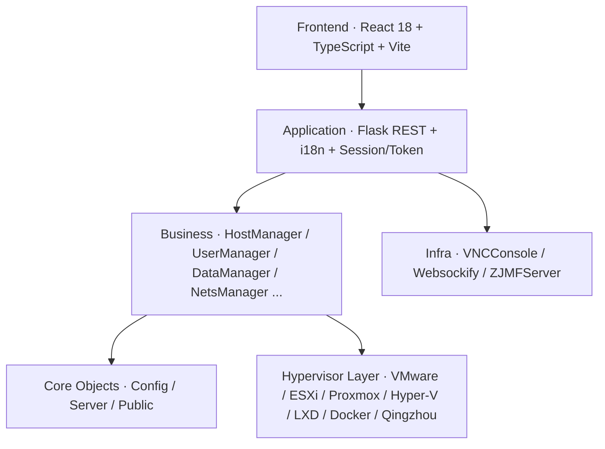

# About OpenIDCS

## What is OpenIDCS?

**OpenIDCS** (Open Internet Data Center System) is an open-source unified IDC virtualization management platform. It provides a single Web console and a complete RESTful API to manage virtual machines that live across many different hypervisors and container runtimes — as if they were part of the same cloud.

## The Problem

Modern data centers rarely speak one language:

- **VMware** runs business-critical workloads;
- **Docker / Podman** drives micro-services;
- **LXC / LXD** powers lightweight multi-tenant environments;
- **Proxmox VE / Hyper-V / ESXi** fill in the rest.

Each platform has its own tools, its own credentials, its own networking model and its own permission system. Engineers spend more time switching consoles than solving problems.

## The OpenIDCS Answer

OpenIDCS puts **one** Web UI and **one** REST API on top of every supported platform:

- Create a VM the same way whether it lands on ESXi, Proxmox or LXD.
- Apply the same port-forwarding rule regardless of the underlying runtime.
- Enforce the same per-user quota across the whole fleet.
- Ship logs, metrics and audit trails to the same pipeline.

## Core Advantages

### 🎯 Unified Console
One Web UI replaces five or six vendor tools.

### 🔌 API-First
Everything the UI does is also a documented REST call — perfect for billing integrations, automation, CI/CD and CMDBs.

### 🌐 Cross-Platform
Run the controller on Windows, Linux or macOS; manage agents running on any of them.

### 👥 Multi-Tenant by Design
RBAC, fine-grained permissions and hard quotas (CPU, memory, storage, bandwidth, VM count) are built in — not bolted on.

### 📊 Observability Included
Real-time host & VM metrics, ECharts dashboards, audit logs and scheduled tasks come out of the box.

### 🔒 Secure
TLS between controller and agents, token + session auth, encrypted VNC, optional IP whitelisting and rate limiting.

### 💰 Zero License Fees
AGPLv3 — use it, fork it, ship it. No per-socket, per-CPU or per-VM pricing.

## Architecture at a Glance

## Target Users

| Scenario | What you get |
|----------|--------------|
| 🏢 SMB IT | Unify dev / test / prod VMs across tools |
| ☁️ Private cloud | A lightweight, skinnable front-end |
| 🎓 Labs & training | Shared VM pool with per-student quotas |
| 🔬 R&D | Self-service VMs without asking ops |
| 🏭 IDC / hosting | Bring a legacy IDC online with billing |

## Platform Support Matrix

| Platform | Status | Notes |
|----------|:------:|-------|
| LXC / LXD | ✅ GA | System containers, REST/HTTPS |
| Docker / Podman / K8s | ✅ GA | TLS + remote API |
| VMware Workstation | ✅ GA | vmrest REST API |
| VMware vSphere ESXi | ✅ GA | pyVmomi |
| Proxmox VE / QEMU | ✅ GA | proxmoxer |
| Windows Hyper-V | ✅ GA | WinRM / WMI |
| Qingzhou Cloud | ✅ GA | Vendor API |
| Oracle VirtualBox | 🚧 WIP | In development |
| QEMU / KVM (standalone) | 🚧 WIP | In development |

## License

OpenIDCS is released under the **GNU Affero General Public License v3.0 (AGPLv3)**:

- ✅ Use, modify and redistribute freely.
- ✅ Commercial use allowed.
- ⚠️ Modifications must be published under the same license.
- ⚠️ Network services based on OpenIDCS must also make their source available.

See [License](/en/about/license) for the full text.

## Credits

Parts of the controlled-node Web & billing-plugin style were inspired by the **zjmf-lxd-server** project by *xkatld* — [GitHub](https://github.com/xkatld/zjmf-lxd-server). Thanks to every open-source contributor who made this possible.

## Next Steps

- 📖 [Core Advantages](/en/guide/advantages) — why teams pick OpenIDCS
- 🧩 [Features](/en/guide/features) — everything in the box
- 🚀 [Quick Start](/en/guide/quick-start) — be productive in 5 minutes
- 🛠️ [Installation](/en/guide/installation) — production-grade deployment
