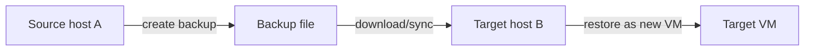

# Backup & Snapshots

OpenIDCS offers two data protection mechanisms for virtual machines — **snapshots** and **full backups** — so you can recover quickly from accidental changes, system corruption or migration.

## Comparison

| Aspect | Snapshot | Backup |
|------|-----------------|---------------|
| **Storage** | Shares the original VM storage pool | Independent backup directory (can be mounted remote storage) |
| **Speed** | Seconds (copy-on-write) | Minutes to hours, depending on VM size |
| **Space usage** | Incremental; very small at first | Full copy, comparable to the original VM |
| **VM deletion** | Snapshots become unusable | Backup remains independent; VM can be rebuilt |
| **Primary use** | Pre-change rollback point, ad-hoc test | Long-term archive, DR, cross-host migration |
| **Suggested cadence** | Manual before critical operations | Scheduled daily / weekly |

::: tip Best Practice
Snapshots are for **short-term** protection (e.g. before a system update). Backups are for **long-term** protection (e.g. archiving business data). Use them together — never replace backup with snapshot.
:::

## Platform Matrix

| Platform | Snapshot | Backup | Restore | List backups | Delete backup |
|------|:----:|:----:|:----:|:--------:|:--------:|
| VMware Workstation | ✅ | ✅ | ✅ | ✅ | ✅ |
| VMware vSphere ESXi | ✅ | ✅ | ✅ | ✅ | ✅ |
| LXC / LXD | ✅ | ✅ | ✅ | ✅ | ✅ |
| Docker / Podman | ✅ (commit) | ✅ | ✅ | ✅ | ✅ |
| Proxmox VE | ✅ | ✅ | ✅ | ⚠️ node-local | ⚠️ node-local |
| Windows Hyper-V | ✅ | ✅ | ✅ | ✅ | ✅ |
| Qingzhou Cloud | ✅ | ✅ | ✅ | ✅ | ✅ |

## Snapshot Management

### Create

1. **VM Management** → pick the VM → **Detail**.
2. Switch to the **Snapshots** tab.
3. Click **Create Snapshot** and fill in:
   - **Name**: e.g. `pre-upgrade-2026-04-24`
   - **Description**: why
   - **Include memory**: capture runtime memory (requires the VM to be running)
4. Click **Confirm**.

::: warning Note
- Capturing memory briefly freezes the VM for a few seconds.
- VMware/ESXi/Hyper-V support multi-layer snapshot trees; Docker commit produces flat image layers.
:::

### Restore

1. Select the target snapshot in the list.
2. Click **Restore to this snapshot**.
3. The system powers off the VM → rolls back disks → powers on again.

::: danger Data Loss Risk
Restoring a snapshot **discards** all disk changes made after it was created. Back up anything important first.
:::

### Delete

- **Delete single**: reclaim the incremental layer.
- **Consolidate all**: merge every snapshot into the current disk (VMware/ESXi only).

::: tip
In production, keep **no more than 3 snapshots** per VM — beyond that, disk I/O degrades significantly.
:::

### Naming Convention (suggested)

```
<action>-<date>-<note>
# Example
pre-upgrade-20260424-kernel
before-patch-20260424-cve
daily-auto-20260424
```

## Full Backup

### Manual Backup

1. VM detail → **Backup** tab.
2. Click **Create Backup**.
3. Fill in:

| Parameter | Description | Recommendation |
|------|------|------|
| Backup name | Filename prefix | Use a meaningful name |
| Description | Free-form note | Record business state |
| Compression | 0 (none) to 9 (max) | 6 balances speed/size |
| Include snapshots | Bundle existing snapshots | Recommended for prod |
| Shutdown before backup | Power off first | Recommended for DB-like VMs |

4. Click **Start Backup**; track progress in the Task Center.

### Backup List

The **Backup** tab shows:

| Field | Meaning |
|------|------|
| Backup ID | Unique identifier |
| Created | Start time |
| Size | Size after compression |
| Status | Completed / In progress / Failed |
| Actions | Restore / Download / Delete |

### Restore

1. Pick a backup and click **Restore**.
2. Pick the mode:
   - **Overwrite current VM**: rollback in place.
   - **Restore as new VM**: create a new VM with new name/IP (good for validation).
3. Confirm and track progress in the Task Center.

::: warning Overwrite destroys current data
Overwrite restore wipes the current VM's disks. Double-check before confirming.
:::

### Download

Click **Download** to fetch the archive locally, typically:
- `.tar.gz` (LXD / Docker)
- `.ova` / `.vmdk` (VMware / ESXi)
- `.vhdx` (Hyper-V)
- `.vma.zst` (Proxmox)

## Scheduled Backup Strategy

### Create a Schedule

1. **System Settings** → **Scheduled Tasks**.
2. Click **New Task** → type **Backup**.
3. Configure:

```yaml
name: daily-backup-prod
targets:
  - tag: env=production
  - or a list of VM IDs
cron: "0 2 * * *"    # every day 02:00
compression: 6
retention:
  - keep 7 daily backups
  - keep 4 weekly backups
  - keep 12 monthly backups
notify: email on success or failure
```

4. Save — the task enters the scheduler queue.

### 3-2-1 Backup Rule (recommended)

```
3 copies of data (1 production + 2 backups)
2 different storage media (local disk + object storage)
1 offsite copy (remote DC / cloud)
```

### Offsite Backup

Mount remote targets under **System Settings → Storage**:

| Type | Fields |
|------|--------|
| NFS | Server, export path, mount point |
| SMB/CIFS | Server, share name, user/password |
| S3-compatible | Endpoint, bucket, access/secret key |
| SFTP | Host, port, user, private key |

Once mounted, tick **Sync to remote storage** in the scheduled task.

## Cross-host Migration

Backups enable migration across hypervisors or hosts:



### Steps

1. Create a full backup on the source (power off for consistency).
2. Download the file to the controller.
3. Upload to the target host → **Restore as new VM**.
4. Adjust network settings (IP / bridge) after restore.

::: tip
Same-platform restore (VMware → VMware) is direct. **Cross-platform** (e.g. VMware → KVM) requires converting the disk format first, e.g. `qemu-img convert -f vmdk -O qcow2 src.vmdk dst.qcow2`.
:::

## Backup Validation

Regularly verify that backups really restore. Suggested monthly exercise:

1. Pick 1–2 representative VMs from production backups.
2. Restore them with **Restore as new VM** on an isolated host.
3. Boot the VM and verify:
   - OS boots cleanly
   - Critical services respond
   - Data integrity (DB row counts, file MD5)
4. Delete the test VM when done.

## API Examples

### Create a backup

```bash
curl -X POST http://localhost:1880/api/vms/{vm_id}/backup \
  -H "Authorization: Bearer YOUR_TOKEN" \
  -H "Content-Type: application/json" \
  -d '{
    "name": "manual-20260424",
    "description": "release v2.1 upgrade",
    "compress": 6,
    "include_snapshots": true
  }'
```

### List backups

```bash
curl http://localhost:1880/api/vms/{vm_id}/backups \
  -H "Authorization: Bearer YOUR_TOKEN"
```

### Restore a backup

```bash
curl -X POST http://localhost:1880/api/vms/{vm_id}/restore \
  -H "Authorization: Bearer YOUR_TOKEN" \
  -H "Content-Type: application/json" \
  -d '{"backup_id": "bak_20260424_020000", "mode": "overwrite"}'
```

## Troubleshooting

| Symptom | Likely Cause | Fix |
|------|----------|----------|
| Backup task stalls | Disk I/O contention | Stagger schedules, cap parallelism |
| Backup file is unexpectedly large | Large zero regions inside the disk | Enable sparse backup, run `fstrim` regularly |
| Restored VM will not boot | Disk format incompatible | Convert with `qemu-img` |
| Snapshot count capped | Platform limit (e.g. VMware 32 levels) | Consolidate old snapshots |
| Remote sync fails | Network / cert issue | Check the mount and task logs |

## Related Docs

- 📋 [Virtual Machine Management](/en/tutorials/vm-management)
- 📊 [Monitoring & Alerts](/en/tutorials/monitoring)
- 📝 [Logs & Audit](/en/tutorials/logs)
- ⚙️ [Server Setup](/en/config/server)
