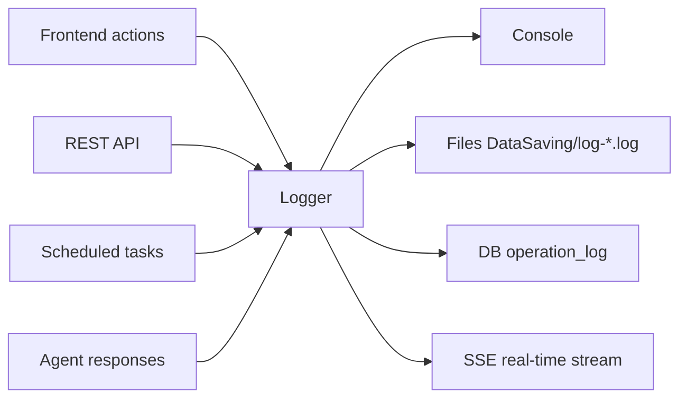

# Logs & Audit Tutorial

OpenIDCS records structured logs for every critical path, with web query, file retention, real-time streaming and export/archive capabilities. This tutorial covers the log architecture, how to query logs, configure alerts and use logs for troubleshooting.

## Log Architecture



| Category | Contents | Storage | Access |
|----------|------|----------|----------|
| Operation | User CRUD on VMs/hosts/users | DB `operation_log` | **Logs → Operations** |
| Audit | Login, permission, token events | DB `audit_log` | **Logs → Audit** |
| System | Flask / Loguru runtime output | `DataSaving/log-main.log` | **Logs → System** |
| Task | Async task execution | `DataSaving/log-task.log` | **Task Center → Task Detail** |
| Access | HTTP requests | `DataSaving/log-access.log` | **Logs → Access** |
| Security | Login failures, suspicious IPs, privilege violations | `DataSaving/log-security.log` | **Logs → Security** |

::: tip File Layout
All file logs live under `DataSaving/`, managed by [Loguru](https://github.com/Delgan/loguru) with size/time rotation and compression.
:::

## Querying Logs

### Common Filters

The **Log Management** page supports:

| Filter | Description |
|--------|------|
| Time range | Last 15 min / 1 h / 24 h / custom |
| Level | DEBUG / INFO / WARNING / ERROR / CRITICAL |
| User | Filter by username |
| Module | VM / Host / User / Net / Auth / System |
| Keyword | Full-text search; use quotes for phrase match |
| Object ID | Quick filter for a specific VM/host |
| Result | success / fail / exception |

### Operation Log Example

| Time | User | Module | Action | Target | Result | Duration |
|------|------|------|------|------|------|------|
| 2026-04-24 10:05:12 | alice | VM | create | `web-01` | success | 3.2s |
| 2026-04-24 10:07:33 | alice | VM | power-on | `web-01` | success | 0.9s |
| 2026-04-24 10:15:48 | bob | User | reset-password | `alice` | denied: insufficient perms | 0.1s |

### Audit Log Example

```
[2026-04-24 09:30:11] LOGIN      success  user=alice  ip=10.1.1.5
[2026-04-24 09:31:02] TOKEN      create   user=alice  name=ci-deploy ttl=90d
[2026-04-24 09:40:27] LOGIN      fail     user=eve    ip=203.0.113.7 reason=bad_password
[2026-04-24 10:15:48] PERMISSION deny     user=bob    action=user:update target=alice
```

### Real-time Stream

Under **Logs → Live**:

1. Pick modules and levels of interest.
2. Click **Start**; the backend streams new entries via SSE.
3. Pause/resume, highlight keywords, export the in-memory buffer.

Think of it as a Web version of `tail -f` — perfect for debugging and reproducing issues.

## Export & Archive

### Web Export

Click **Export** at the top of a query result:

- **CSV**: for Excel analysis
- **JSON**: preserves the full structured payload
- **Bundle**: all file logs within the selected timeframe

### File Retention

Default files under `DataSaving/`:

```
log-main.log                   Current main log
log-main.2026-04-23.log.zip    Rotated history
log-access.log                 Access log
log-task.log                   Task log
log-security.log               Security log
```

Tunable via `.env`:

```ini
LOG_LEVEL=INFO
LOG_ROTATION=10 MB    # Rotate when file reaches 10MB
LOG_RETENTION=30 days # Keep 30 days
LOG_COMPRESSION=zip   # Archive format
```

### Shipping to External Systems

For long-term retention and aggregation, integrate with ELK / Loki / Splunk.

#### Option 1: Filebeat + Elasticsearch

```yaml
# filebeat.yml
filebeat.inputs:
  - type: log
    paths:
      - /opt/OpenIDCS-Client/DataSaving/log-*.log
    json.keys_under_root: true
    json.add_error_key: true

output.elasticsearch:
  hosts: ["http://elk:9200"]
  index: "openidcs-%{+yyyy.MM.dd}"
```

#### Option 2: Promtail + Loki

```yaml
scrape_configs:
  - job_name: openidcs
    static_configs:
      - targets: [localhost]
        labels:
          job: openidcs
          __path__: /opt/OpenIDCS-Client/DataSaving/log-*.log
```

## Alerts & Notifications

### Alert Rules

Create rules under **Logs → Alert Rules**:

| Field | Example | Description |
|------|------|------|
| Name | `login-bruteforce` | Rule identifier |
| Condition | Same IP ≥ 10 login failures in 10 min | Aggregation expression |
| Level | WARNING | Used for notification routing |
| Actions | Block IP / email / webhook | Composable |
| Cooldown | 30 min | Avoid alert storms |

### Common Rule Templates

- **Brute force**: bursts of `LOGIN fail` from one user/IP
- **Privilege probing**: repeated `PERMISSION deny` from one user
- **Mass deletion**: > 10 VMs deleted in a single action
- **Quota exhaustion**: quota usage > 95 %
- **Host offline**: `Host unreachable` > 2 min

### Channels

| Channel | Location | Notes |
|------|----------|------|
| Email | System Settings → SMTP | Supports HTML templates |
| Webhook | Alert Rule → Action → Webhook | Compatible with Feishu/DingTalk/WeChat Work bots |
| In-app | Enabled by default | Bell badge after login |
| Syslog | `.env` `SYSLOG_HOST` | For enterprise SOC integration |

#### Feishu Webhook Example

```bash
curl -X POST "https://open.feishu.cn/open-apis/bot/v2/hook/xxxxx" \
  -H 'Content-Type: application/json' \
  -d '{
    "msg_type": "text",
    "content": { "text": "⚠️ OpenIDCS alert: [${rule}] ${desc}" }
  }'
```

## Common Scenarios

### Scenario 1: "Why did this VM fail to start?"

1. Copy the VM ID from the **VM Management** list.
2. Go to **Logs → Operations** and filter by **Object ID**.
3. Find the most recent failed `power-on`, click to expand the full stack trace.
4. If it is an agent-side error, switch to **System Logs** and drill down by timestamp.

### Scenario 2: "Who deleted the production VM?"

1. Go to **Audit Log**, pick action type `vm:delete`.
2. Filter by time and target name.
3. The result shows: operator, source IP, User-Agent and token name.

### Scenario 3: "When did the system slow down?"

1. Go to **Access Log**, sort by P95 response time.
2. Identify slow endpoints and peak time.
3. Cross-check **System Log** `WARNING`/`ERROR` for DB locks or host disconnects.

## Retention & Privacy

::: warning Compliance
- Logs may contain IPs, User-Agents and similar personal data — set retention per local regulations.
- Exported log files should be transferred and stored encrypted.
- Passwords, tokens and private keys are **never recorded**; accidental captures are masked as `***`.
:::

Tunable retention policy:

```ini
# .env
OPERATION_LOG_RETENTION=180  # days
AUDIT_LOG_RETENTION=365      # recommended to be longer
ACCESS_LOG_RETENTION=30
SECURITY_LOG_RETENTION=90
```

## FAQ

### Log files are too large

- Lower `LOG_ROTATION` (e.g. `5 MB`) and `LOG_RETENTION` in `.env`.
- Raise `LOG_LEVEL` to `WARNING` to drop DEBUG/INFO noise.
- Archive historic logs to external object storage (S3/OSS) and purge locally.

### Web query caps prevent viewing older entries

The web layer only indexes the last 30 days. For older data:

1. `zgrep` archived files under `DataSaving/` from the command line.
2. Or query the centralized store (ELK/Loki).

### Real-time stream is interrupted by a proxy

SSE requires long-lived connections; for Nginx:

```nginx
location /api/logs/stream {
  proxy_pass http://127.0.0.1:1880;
  proxy_buffering off;
  proxy_http_version 1.1;
  proxy_set_header Connection '';
  proxy_read_timeout 1h;
}
```

## See Also

- [Virtual Machine Management](/en/tutorials/vm-management)
- [User Management](/en/tutorials/user-management)
- [Permissions](/en/tutorials/permissions)
- [Monitoring & Alerts](/en/tutorials/monitoring)
- [Server Setup](/en/config/server)
