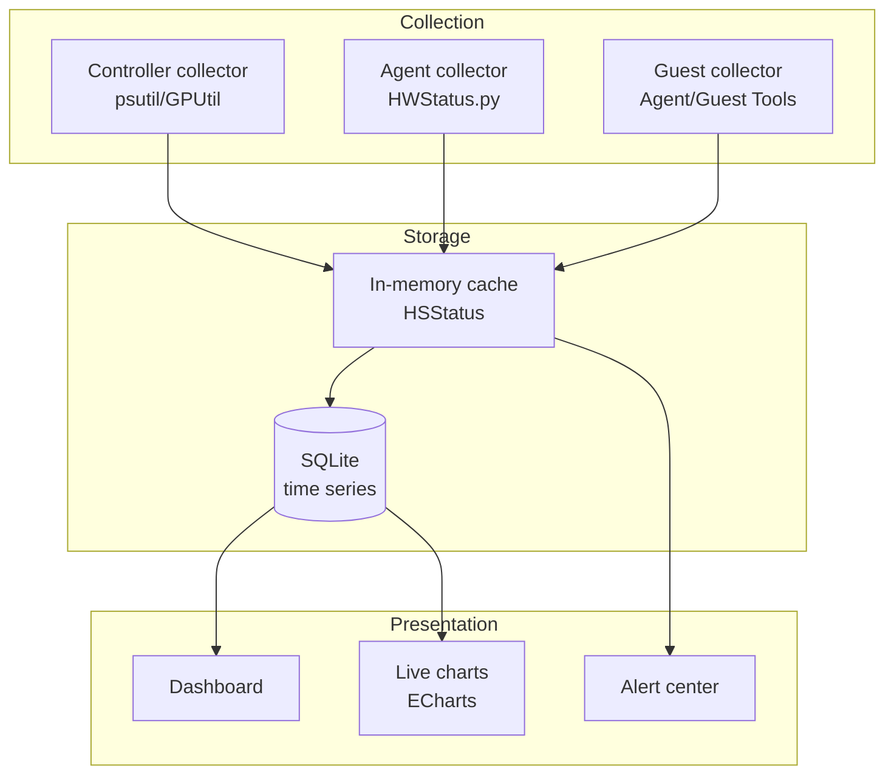
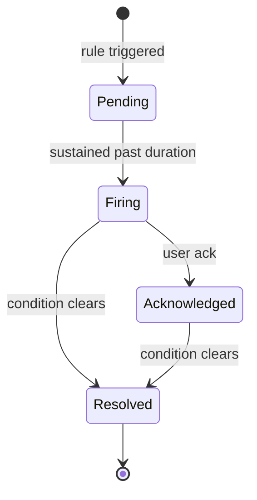

# Monitoring & Alerts

OpenIDCS ships with a full monitoring stack covering the controller, agent hosts and VMs. It provides live metrics, resource statistics, threshold alerts and anomaly notifications.

## Architecture



## Dashboard Overview

After login the first view is the **Overview Dashboard** at `/dashboard`.

### Key Indicator Cards

| Card | Meaning | Range |
|------|------|----------|
| Hosts total / online | Number of registered and currently reachable hosts | number |
| VMs total / running | Total and running VMs across platforms | number |
| Overall CPU usage | Weighted average | 0-100% |
| Overall memory usage | Used / Total | 0-100% |
| Storage usage | Disk occupancy | 0-100% |
| Network throughput | Aggregate in/out bandwidth | MB/s |
| Ops in last 24h | User operation count | number |
| Unacknowledged alerts | Active alerts not yet acknowledged | number |

### Chart Area

- **Resource trends**: CPU / memory / disk curves for the last 1h / 24h / 7d
- **Host distribution**: pie chart by platform type (VMware/LXC/Docker/PVE/...)
- **Top 5 hottest VMs**: sorted by CPU
- **Recent ops**: the 10 most recent critical operations

## Host Monitoring

### Host Detail

Go to **Host Management** and click a host name to open the detail page, which includes:

#### Hardware Info

| Field | Description |
|------|------|
| CPU | Vendor, cores, frequency |
| Memory | Size, type, speed |
| Disks | Size and free space per disk |
| NICs | MAC, IP, link speed |
| GPU | Model (if present) |
| OS | Operating system and kernel version |

#### Live Performance

- **CPU curve**: per core, per process
- **Memory curve**: Used / Cached / Buffer / Free
- **Disk I/O**: Read / Write IOPS and MB/s
- **Network**: Upload / Download Mbps
- **Load average**: 1m / 5m / 15m

#### Collection Frequency

| Resolution | Default interval | Retention |
|----------|----------|----------|
| Live | 5s | 1h |
| Minute | 1min | 24h |
| Hour | 1h | 30d |
| Daily rollup | 1d | 1y |

Tunable via `settings.json`:

```json
{
  "monitoring": {
    "realtime_interval": 5,
    "minute_retention_hours": 24,
    "hour_retention_days": 30
  }
}
```

## VM Monitoring

### Entry

The **Monitoring** tab on a VM's detail page shows per-instance metrics.

### Metric Coverage

| Metric | VMware | LXC | Docker | PVE | HyperV | ESXi | Qingzhou |
|------|:------:|:---:|:------:|:---:|:------:|:----:|:--------:|
| Power state | ✅ | ✅ | ✅ | ✅ | ✅ | ✅ | ✅ |
| CPU usage | ✅ | ✅ | ✅ | ✅ | ✅ | ✅ | ✅ |
| Memory usage | ✅ | ✅ | ✅ | ✅ | ✅ | ✅ | ✅ |
| Disk I/O | ✅ | ✅ | ✅ | ✅ | ⚠️ | ✅ | ⚠️ |
| Network | ✅ | ✅ | ✅ | ✅ | ✅ | ✅ | ✅ |
| Process list | ❌ | ✅ | ✅ | ❌ | ❌ | ❌ | ❌ |
| Guest-internal metrics | ⚠️ | ✅ | ✅ | ⚠️ | ⚠️ | ⚠️ | ❌ |

::: tip
⚠️ requires a Guest Agent or VMware Tools to be available.
:::

### Installing the Guest Agent (optional)

Install an Agent inside the VM for finer-grained guest metrics:

#### Linux

```bash
wget https://get.openidcs.org/agent/install.sh
sudo bash install.sh --server https://controller:1880 --token YOUR_VM_TOKEN
sudo systemctl enable --now openidcs-agent
```

#### Windows

Download and run `openidcs-agent-setup.exe` and enter the controller URL and VM token in the wizard.

## Alert Rules

### Built-in Rules

| Rule | Default threshold | Level |
|----------|----------|------|
| Host offline | 3 consecutive probe failures | 🔴 Critical |
| Host CPU overload | > 90% for 5 min | 🟠 Warning |
| Host memory overload | > 90% for 5 min | 🟠 Warning |
| Disk space low | free < 10% | 🟠 Warning |
| Disk space exhausted | free < 5% | 🔴 Critical |
| Unexpected VM stop | shutdown not requested by user | 🟠 Warning |
| VM creation failed | Task failure | 🟡 Info |
| Quota near cap | resource usage approaching 100% | 🟡 Info |
| Login failure burst | > 5 within 5 min | 🟠 Warning |
| Token about to expire | < 24h remaining | 🟡 Info |

### Custom Rules

Go to **System Settings → Alert Rules → Add Rule**:

```json
{
  "name": "Core business VM CPU",
  "target_type": "vm",
  "target_filter": {
    "tags": ["production", "critical"]
  },
  "metric": "cpu.usage",
  "operator": ">",
  "threshold": 80,
  "duration_seconds": 300,
  "level": "warning",
  "cooldown_seconds": 1800,
  "notify_channels": ["email:ops", "webhook:slack"]
}
```

#### Available Fields

- `target_type`: `host` / `vm` / `user` / `system`
- `metric`: `cpu.usage` / `memory.usage` / `disk.usage` / `network.in` / `network.out` / `disk.io.read` / `disk.io.write`
- `operator`: `>` / `>=` / `<` / `<=` / `==`
- `level`: `info` / `warning` / `critical`
- `cooldown_seconds`: silence window after firing, prevents alert storms

## Notification Channels

### Email

SMTP configuration:

```json
{
  "smtp": {
    "host": "smtp.example.com",
    "port": 465,
    "ssl": true,
    "user": "alert@example.com",
    "password": "YOUR_PASSWORD",
    "from": "OpenIDCS Alert <alert@example.com>"
  },
  "recipients": {
    "ops": ["ops1@example.com", "ops2@example.com"],
    "admin": ["admin@example.com"]
  }
}
```

### Webhook

POST JSON to any URL, compatible with Slack, DingTalk, Feishu and WeCom:

```json
{
  "webhooks": {
    "slack": {
      "url": "https://hooks.slack.com/services/XXX/YYY/ZZZ",
      "format": "slack"
    },
    "dingtalk": {
      "url": "https://oapi.dingtalk.com/robot/send?access_token=XXX",
      "format": "dingtalk",
      "secret": "SEC_XXX"
    },
    "feishu": {
      "url": "https://open.feishu.cn/open-apis/bot/v2/hook/XXX",
      "format": "feishu"
    },
    "wecom": {
      "url": "https://qyapi.weixin.qq.com/cgi-bin/webhook/send?key=XXX",
      "format": "wecom"
    }
  }
}
```

#### Sample Payload

```json
{
  "rule_id": 12,
  "rule_name": "Core business VM CPU",
  "level": "warning",
  "target": {
    "type": "vm",
    "id": "vm-001",
    "name": "web-prod-01"
  },
  "metric": "cpu.usage",
  "value": 87.5,
  "threshold": 80,
  "triggered_at": "2026-04-24T12:20:00+08:00",
  "message": "VM web-prod-01 CPU usage 87.5% exceeded 80% threshold for 5 minutes"
}
```

### SMS / Phone (Enterprise integrations)

Use webhooks to integrate Aliyun SMS, Tencent Cloud SMS or PagerDuty.

## Alert Center

Found in the left menu as **Alert Center**:

| Feature | Description |
|------|------|
| Active alerts | Unacknowledged alerts |
| History | Acknowledged or resolved alerts |
| Statistics | Aggregations by level / type / target |
| Silence | Mute selected alerts during maintenance windows |
| Bulk ack | Acknowledge multiple alerts at once |

### Alert Lifecycle



## Reports

Go to **Report Center** to produce periodic reports:

- **Daily / Weekly / Monthly**: CPU, memory, disk and network peaks and averages
- **User resource usage**: quota usage aggregated by user
- **Host health**: availability and alert counts per host
- **Billing** (Enterprise): charges by quota × usage duration

Reports can be exported as PDF, Excel or CSV.

## Third-party Integrations

### Prometheus

OpenIDCS exposes a Prometheus metrics endpoint:

```
GET /api/metrics
```

`prometheus.yml`:

```yaml
scrape_configs:
  - job_name: 'openidcs'
    bearer_token: 'YOUR_API_TOKEN'
    static_configs:
      - targets: ['openidcs.example.com:1880']
```

### Grafana

Import the official dashboard (ID: `openidcs-overview`) which contains:
- Global resource view
- VM counts per platform over time
- Top-N consumers
- Alert trends

## FAQ

### Chart has gaps

**Reason**: collector crash or host offline.

**Investigate**:
```bash
tail -n 100 DataSaving/log-monitor.log | grep ERROR
```

### CPU usage looks off

**Reason**: Hyper-V and Qingzhou Cloud expose hypervisor metrics at minute granularity, so values are minute averages.

**Mitigation**: install the Guest Agent inside the VM for more accurate data.

### Alert does not fire

**Checklist**:
1. Is the rule enabled?
2. Is `duration_seconds` too long?
3. Was the rule already triggered within `cooldown_seconds`?
4. Is the notification channel configured correctly? (Test via **Alert Rules → Send test**.)

## Next Steps

- 🔌 Configure [Network & Port Forwarding](/en/tutorials/network)
- 💾 Learn [Backup & Snapshots](/en/tutorials/backup)
- 📝 Explore [Logs & Audit](/en/tutorials/logs)
