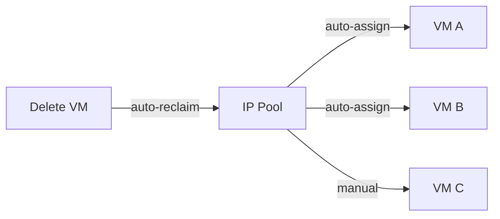

# Network & Port Forwarding

OpenIDCS provides a complete virtual networking stack — IP pools, NAT port forwarding, Web reverse proxy, iptables firewall, SSH tunneling — a one-stop solution for exposing VM services.

## Capability Overview

| Capability | Scenario | Description |
|------|------|------|
| **IP pool** | Auto-assign IPv4/IPv6 | Pools per host or global; automatic allocation on VM creation |
| **NAT port forward** | Reach internal VMs from the public network | iptables/nftables DNAT; TCP/UDP |
| **Web reverse proxy** | Expose services by domain | Built-in HTTP proxy with wildcard + self-signed SSL |
| **iptables firewall** | Fine-grained traffic control | Allow/deny by port/protocol/source |
| **Bandwidth shaping** | Fair bandwidth sharing | `tc`-based ingress/egress caps |
| **SSH direct** | Terminal management | Controller tunnels SSH to internal VMs |

---

## IP Pool Management

### How It Works



Pool types:
- **Public pool**: bound to a bridged network (`docker-pub` / `br-pub` / `VMnet0`)
- **Private pool**: bound to a NAT network (`docker-nat` / `br-nat` / `VMnet8`)

### Create a Pool

1. Go to **Network → IP Pools**.
2. Click **Create Pool** and fill in:
   - Name: `public-pool-1`
   - Type: `public / private`
   - Start: `114.193.206.1`
   - End: `114.193.206.254`
   - Netmask: `255.255.255.0`
   - Gateway: `114.193.206.254`
   - DNS: `223.5.5.5, 8.8.8.8`
3. Save; the pool becomes selectable when creating a VM.

### Reserved Addresses

Click **Reserve** in the pool list to exclude specific IPs (e.g. for physical devices):

```
114.193.206.1   - Switch
114.193.206.2   - Router
114.193.206.254 - Gateway
```

### Quota

Per-user IP quota (see [Permissions](/en/tutorials/permissions)) prevents pool exhaustion.

---

## NAT Port Forwarding

### Scenario

The VM uses a private IP (`10.0.0.*`) and you want to expose host public ports so the outside world can reach the VM's Web/SSH/DB services.

### Add a Forward

1. Open the VM detail → **Network** tab.
2. Click **Add Port Forward**.
3. Fill in:

| Field | Example | Description |
|------|------|------|
| Protocol | TCP | TCP or UDP |
| Host port | 10022 | Port exposed to the public |
| VM IP | 10.0.0.5 | Internal IP |
| VM port | 22 | Service port inside the VM |
| Note | SSH | Free-form note |

4. On save, OpenIDCS runs on the agent:

```bash
iptables -t nat -A PREROUTING -p tcp --dport 10022 -j DNAT --to-destination 10.0.0.5:22
iptables -t nat -A POSTROUTING -p tcp -d 10.0.0.5 --dport 22 -j MASQUERADE
```

### Bulk Import

Import via CSV:

```csv
protocol,host_port,vm_ip,vm_port,note
tcp,8080,10.0.0.5,80,Web
tcp,10022,10.0.0.5,22,SSH
udp,5353,10.0.0.6,53,DNS
```

### Common Ports

| Service | Port | Protocol |
|------|------|------|
| SSH | 22 | TCP |
| HTTP | 80 | TCP |
| HTTPS | 443 | TCP |
| RDP | 3389 | TCP |
| MySQL | 3306 | TCP |
| PostgreSQL | 5432 | TCP |
| Redis | 6379 | TCP |
| MongoDB | 27017 | TCP |

---

## Web Reverse Proxy

### When to Use

- VMs host Web services you want to reach by domain (not `IP:port`)
- Multiple VMs need to share ports 80/443
- Automatic SSL issuance is required

### Setup

1. Point the domain's A record to the **controller's** public IP.
2. Go to **Network → Web Proxy → New Proxy**.
3. Fill in:

| Field | Example |
|------|------|
| Domain | `app.example.com` |
| Target | `10.0.0.5` |
| Target port | `80` |
| Protocol | `HTTP` |
| Enable SSL | ✅ |
| Cert source | `self-signed / upload / Let's Encrypt` |
| WebSocket | ✅ |

4. OpenIDCS reloads the built-in proxy rules automatically.

### Wildcard

Use `*.user1.example.com` as a wildcard template so every VM owned by a given user gets a sub-domain automatically.

### SSL Auto-renew

With Let's Encrypt, OpenIDCS scans daily at 02:00 for certificates expiring within 30 days and renews them:

```bash
# Manual renewal (on the controller)
python HostServer.py --renew-ssl
```

---

## iptables Firewall

### Policy Model

Each VM can have its own firewall rules. OpenIDCS generates the corresponding `iptables` / `nftables` chains on the agent.

### Add a Rule

VM detail → **Firewall** → **Add Rule**:

| Field | Example | Description |
|------|------|------|
| Direction | inbound / outbound | Traffic direction |
| Protocol | TCP / UDP / ICMP / ALL | |
| Source | `192.168.1.0/24` or `any` | CIDR supported |
| Dest ports | `22,80,443` | Lists and ranges `8000-9000` |
| Action | allow / reject / drop | |
| Priority | 100 | Lower number = higher priority |

### Common Templates

| Template | Rules |
|------|------|
| **Web server** | Allow 80/443; deny other inbound |
| **Database** | Only controller IP may reach 3306 |
| **Strict** | Only SSH; deny everything else |
| **Open** | Allow everything inbound (test only) |

### Inspecting Rules

On the agent you can view the effective rules:

```bash
# Docker host
iptables -t filter -L OPENIDCS-VM-<vmid> -n -v

# LXD host
nft list chain inet openidcs vm-<vmid>
```

---

## Bandwidth Shaping

### Configuration

VM edit page → **Advanced → Bandwidth**:

| Field | Unit | Description |
|------|------|------|
| Ingress limit | Mbps | External → VM |
| Egress limit | Mbps | VM → External |
| Burst | KB | `tc` burst, auto by default |

OpenIDCS uses `tc qdisc htb`:

```bash
# Equivalent of 100 Mbps egress cap
tc qdisc add dev veth-<vmid> root handle 1: htb default 10
tc class add dev veth-<vmid> parent 1: classid 1:10 htb rate 100mbit
```

### Traffic Statistics

VM detail → **Monitoring → Network** shows:
- Current ingress/egress rate
- 24-hour traffic curve
- Monthly cumulative traffic (used by quota)

---

## SSH Direct Tunnel

For VMs behind NAT, OpenIDCS can forward SSH via the controller.

### Usage

1. VM detail → click **Web Terminal**.
2. The controller transparently proxies to the VM's port 22.
3. No explicit port forward is required.

Or with a local SSH client:

```bash
# ProxyJump via the controller
ssh -J openidcs@openidcs.example.com root@10.0.0.5
```

---

## Multi-NIC Configuration

LXD / Proxmox / ESXi / VMware support multiple NICs per VM.

### Example (LXD)

```yaml
devices:
  eth0:
    nictype: bridged
    parent: br-pub
    type: nic
  eth1:
    nictype: bridged
    parent: br-nat
    type: nic
```

### Web UI

1. VM detail → **NICs** tab.
2. Click **Add NIC**, pick the bridge, specify MAC (or auto-generate).
3. After boot, configure IP inside the VM.

---

## Troubleshooting

### Port forward does not work

```bash
# 1. List the DNAT rules
iptables -t nat -L PREROUTING -n --line-numbers

# 2. Verify IP forwarding is on
cat /proc/sys/net/ipv4/ip_forward  # expect 1
sysctl -w net.ipv4.ip_forward=1

# 3. Verify MASQUERADE
iptables -t nat -L POSTROUTING -n
```

### Reverse proxy returns 502

- Make sure the VM service is up: `curl http://10.0.0.5:80`.
- Check any security group / firewall that might block the controller.
- Inspect the controller log: `tail -f DataSaving/log-http-proxy.log`.

### VM cannot reach the internet

```bash
# Inside the VM
ping GATEWAY_IP     # gateway reachable?
ping 8.8.8.8        # external reachable?
cat /etc/resolv.conf  # DNS?
```

---

## Best Practices

1. **Separate public and private**: keep sensitive services on private networks, expose only what's necessary via port forwarding.
2. **Least privilege**: default-deny firewall, open only what's needed.
3. **Document rules**: always fill in the **Note** field for port forwards / firewall rules.
4. **Cleanup**: stale rules are reclaimed automatically when VMs are deleted; cross-check the log if anything looks off.

---

## Next Steps

- 💾 [Backup & Snapshots](/en/tutorials/backup)
- 📊 [Monitoring & Alerts](/en/tutorials/monitoring)
- 👥 [User Management](/en/tutorials/user-management)
