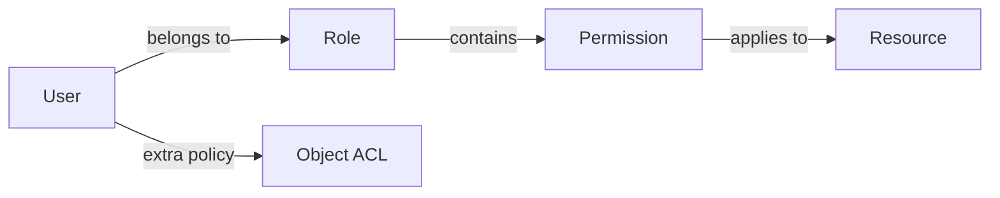
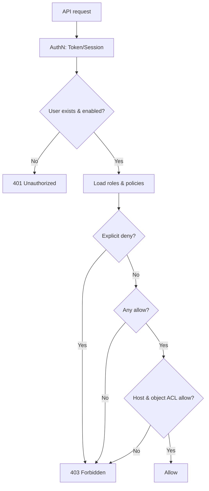

# Permissions Tutorial

OpenIDCS implements **RBAC (Role-Based Access Control)** with additional **resource-level** and **action-level** granularity. This tutorial shows how to design roles, assign permissions and enforce them in API calls.

## Permission Model



Core concepts:

| Concept | Description |
|------|------|
| Permission | Smallest unit, e.g. `vm:create` |
| Role | A permission bundle, e.g. `operator = {vm:*, net:read}` |
| Policy | Additional rules stacked on a user or role |
| ACL | Access list for a specific object (one VM) |

## Permission Catalog

Naming rule: `<module>:<action>`, where `*` means all actions.

### VM module (vm)

| Permission | Description |
|--------|------|
| `vm:create` | Create VMs |
| `vm:read` | View VM info |
| `vm:update` | Modify config (CPU/Mem/Disk/NIC) |
| `vm:delete` | Delete VMs |
| `vm:power` | Power ops (start/stop/reboot/suspend) |
| `vm:console` | Access console / terminal |
| `vm:snapshot` | Snapshot management |
| `vm:backup` | Backup and restore |
| `vm:migrate` | Migrate to another host |
| `vm:*` | All of the above |

### Host module (host)

| Permission | Description |
|--------|------|
| `host:read` | View host list and metrics |
| `host:create` | Add an agent host |
| `host:update` | Modify host parameters |
| `host:delete` | Remove a host |
| `host:manage` | Maintenance mode, restart agent |

### Network module (net)

| Permission | Description |
|--------|------|
| `net:read` | View IP pools, port forwards, proxy rules |
| `net:nat` | Configure NAT port forwarding |
| `net:proxy` | Configure Web reverse proxy |
| `net:firewall` | Configure firewall rules |
| `net:ippool` | Manage IP pools |

### User / RBAC module (user / rbac)

| Permission | Description |
|--------|------|
| `user:read` | View user list |
| `user:create` | Create users |
| `user:update` | Update account info / quota |
| `user:delete` | Delete users |
| `rbac:manage` | Manage roles, permissions and policies |

### System module (sys)

| Permission | Description |
|--------|------|
| `sys:config` | Modify global settings |
| `sys:log` | View logs |
| `sys:audit` | View audit log |
| `sys:backup` | System-level backup |

## Built-in Roles

| Role | Permissions | Intended For |
|------|--------|----------|
| `admin` | `*:*` (everything) | System administrator |
| `operator` | `vm:*`, `host:read`, `net:read`, `net:nat`, `net:proxy` | Ops engineer |
| `user` | `vm:create`, `vm:read`, `vm:update`, `vm:delete`, `vm:power`, `vm:console`, `vm:snapshot`, `vm:backup` | Regular tenant |
| `readonly` | `vm:read`, `host:read`, `net:read`, `sys:log` | Auditors / viewers |
| `guest` | `vm:read` (own only) | Temporary guest |

::: tip Tip
Built-in roles cannot be deleted, but can be overridden — a custom role with the same name takes precedence.
:::

## Custom Roles

### Create a Role

1. Go to **Permissions → Roles → Create Role**.
2. Fill in the identifier (e.g. `backup-operator`) and description.
3. Tick the required permissions in the permission tree:
   ```
   ✅ vm:read
   ✅ vm:backup
   ✅ vm:snapshot
   ✅ sys:log
   ```
4. Click **Save**.

### Clone a Role

To tweak an existing role:

1. Open the role detail → **Clone as New Role**.
2. Rename it, adjust permissions, save.

### Assign a Role

Under **User Management → User Detail → Roles**:

- **Primary role**: single select, decides default permissions
- **Additional roles**: multi-select, permissions are unioned

### Manage Roles via API

```bash
# Create a role
POST /api/rbac/role
{
  "name": "backup-operator",
  "desc": "Operator who only manages backups",
  "permissions": ["vm:read", "vm:backup", "vm:snapshot", "sys:log"]
}

# Assign roles to a user
POST /api/user/alice/roles
{ "roles": ["user", "backup-operator"] }
```

## Object-level ACL

On top of role permissions, OpenIDCS lets you grant access to a specific instance:

1. VM detail page → **Share & Authorize**.
2. Add collaborators and pick a permission set:
   ```
   bob   → read-only
   carol → power ops (power + read)
   dave  → full control (all except delete)
   ```
3. The authorized user will see the shared instance in their own list.

::: warning Note
Object-level ACL can only **narrow**, never widen: if the user's role lacks `vm:read`, granting `read` on a specific VM still has no effect.
:::

## Policy

For more complex conditions use policy expressions:

```yaml
# Example: only allow power/update on prod VMs during working hours
name: production-hours
effect: allow
actions: ["vm:power", "vm:update"]
resources: ["vm:prod-*"]
conditions:
  time:
    weekday: [1,2,3,4,5]
    hour: [9, 18]
  ip:
    cidr: ["10.0.0.0/8"]
```

Fields:

| Field | Description |
|------|------|
| `effect` | `allow` or `deny` |
| `actions` | List of permissions, supports wildcards |
| `resources` | Resource match, supports prefix / regex |
| `conditions` | Optional: time, IP, MFA state, etc. |

::: tip Priority
`deny` outranks `allow`: if any applicable policy denies, access is refused.
:::

## Host ACL

Under **User Management → Host ACL** tick which hosts a user may use. This is a coarse, physical isolation layer:

- Tick `docker-01` → user can only create / view / operate instances on `docker-01`
- Leave empty → fall back to the global default (allow-all or deny-all, controlled by a global switch)

## Authorization Flow



## Common Scenarios

### Scenario 1: Read-only auditor

```
Role: auditor
Permissions: vm:read, host:read, net:read, sys:log, sys:audit
Host ACL: all hosts
Quota: 0 (no resource creation)
```

### Scenario 2: Ops engineer that cannot delete

```
Base role: operator
Additional deny policy:
  actions: ["vm:delete", "host:delete"]
  resources: ["*"]
```

### Scenario 3: Isolated R&D tenant

```
Role: user
Host ACL: dev-lxd-01, dev-docker-01
Quota: 20 vCPU / 40 GB RAM / 1 TB disk / 20 instances
```

## FAQ

### Why don't my permission changes take effect immediately?

A token's permissions are **snapshotted at issue time**. To make changes effective right away:

1. Revoke the user's existing tokens and force re-login.
2. Wait for the token to expire naturally (default 24 h).

You can also enable **"broadcast permission change"** in the System Settings — the backend will push a refresh to the frontend.

### I accidentally deleted a custom role

- Built-in roles cannot be deleted, so that's never an issue.
- Deleted custom roles land in the **Recycle Bin** for 7 days.
- After that, restore from a database backup (see [Server Setup → Backup](/en/config/server)).

### User can see a VM but not access its console

Check whether the user/role has `vm:console`. Viewing and console are separate permissions.

## See Also

- [User Management](/en/tutorials/user-management)
- [Virtual Machine Management](/en/tutorials/vm-management)
- [Logs & Audit](/en/tutorials/logs)
