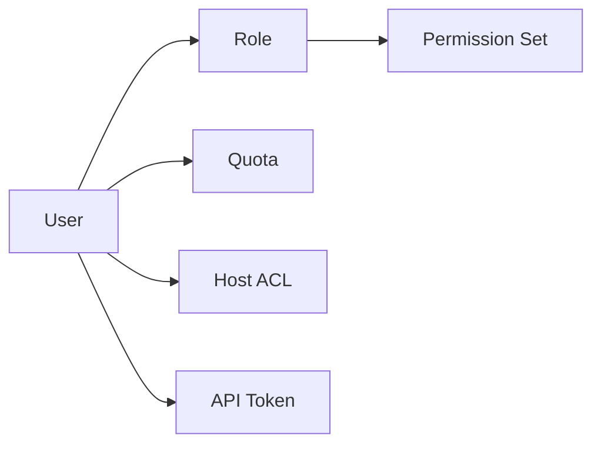

# User Management Tutorial

OpenIDCS ships with a built-in multi-tenant user system — accounts, resource quotas, API tokens, session control and basic auditing. This tutorial walks through day-to-day account operations under the **User Management** menu.

## Concepts at a Glance



| Concept | Description |
|------|------|
| User | An independent login account, globally unique username |
| Role | `admin` / `operator` / `user` / `readonly` etc.; determines default permission set |
| Quota | Caps on CPU, memory, disk, instance count, network traffic, etc. |
| Host ACL | Restricts a user to a subset of registered agent hosts |
| API Token | Invokes the REST API without username/password; individually revocable |

## Creating a User

1. Navigate to **User Management → Users → Create User**.
2. Fill in the form:

    | Field | Requirement |
    |------|------|
    | Username | 3–32 alphanumerics + underscore, globally unique |
    | Password | ≥ 8 chars, mixed case + digits, symbols recommended |
    | Email | For password recovery and alert notifications |
    | Role | Choose a preset role, customize in [Permissions](/en/tutorials/permissions) |
    | Status | Enabled / Disabled |
    | Expires At | Optional — account auto-disabled once expired |

3. Under the **Quota** tab set resource limits:

    ```
    CPU         : 8 vCPU
    Memory      : 16384 MB
    Disk        : 500 GB
    Instances   : 10
    Snapshots   : 20
    Monthly TX  : 500 GB
    ```

4. Under **Host ACL** check the agent hosts this user may use.
5. Click **Create**. If email is configured, an activation email is sent to the user.

### Via API

```bash
curl -X POST http://localhost:1880/api/user/create \
  -H "Authorization: Bearer <AdminToken>" \
  -H "Content-Type: application/json" \
  -d '{
    "username": "alice",
    "password": "Str0ng@Pass",
    "email": "alice@example.com",
    "role": "operator",
    "quota": { "vcpu": 8, "memory": 16384, "disk": 500, "vms": 10 },
    "hosts": ["docker-01", "lxd-01"]
  }'
```

## Login & Sessions

### Login Methods

| Method | Description |
|------|------|
| Username + Password | Standard web login |
| Bootstrap Token | Temporary token printed at first startup |
| API Token | Generated from **Profile → Tokens**; passed as `Authorization: Bearer xxx` |
| SSO (planned) | OIDC / LDAP integration |

### Session Policy

Default policy (tunable in the `.env` of [Server Setup](/en/config/server)):

- **Session timeout**: 3600 s (auto logout on inactivity)
- **Login lockout**: 5 failed attempts → locked for 30 min
- **Password expiration**: off by default; can be set to 90/180 days
- **Cookie flags**: enable `Secure` + `HttpOnly` in production

### Force Logout

Admins under **User Management → Online Users** can see active sessions and:

- View login IP, User-Agent, login time
- Force logout (revokes the session token)
- Disable account (all sessions are voided immediately)

## Modify & Disable

| Operation | Entry | Notes |
|------|------|------|
| Reset Password | User detail → **Reset Password** | Admin resets directly; user rotates from Profile |
| Change Role | User detail → **Role** | Takes effect immediately |
| Adjust Quota | User detail → **Quota** | Reducing quota does not free in-use resources, only caps new requests |
| Disable Account | User detail → **Status** | Disabled users cannot log in; existing VMs are kept but immutable |
| Delete Account | User detail → **Delete** | Requires recycling owned instances first; 30-day retention |

## Quota Management

### Quota Items

| Item | Unit | Computation |
|--------|------|----------|
| vCPU | cores | Sum across running instances |
| Memory | MB | Sum across running instances |
| Disk | GB | Sum across all instances (including powered off) |
| Instances | count | Powered-off included, recycle bin excluded |
| Snapshots | count | Total snapshots across all owned instances |
| Monthly TX | GB | Auto reset at 00:00 on the 1st of each month |

### Quota Alerts

Under **User Management → Quota Alerts** admins can enable:

- **80 % warning**: email + in-system notification
- **100 % block**: prevent creating new instances
- **Top-up**: connect to a billing webhook (custom implementation)

## API Token Management

1. Go to **Profile → API Tokens → Create Token**.
2. Configure:
   - **Name**: describes the purpose (e.g. `ci-deploy`)
   - **TTL**: never / 30 days / 90 days / custom
   - **Scope**: inherit user perms or narrow down to a subset (e.g. read-only)
   - **IP allowlist**: restrict the token to specific source IPs
3. The token is **shown only once** — copy it immediately.
4. If leaked, click **Revoke** in the list; invalidation is immediate.

::: tip Best Practice
- Create a dedicated token for each consumer (CI/CD, monitoring, backup) for easier audit and rotation.
- Never commit tokens to repos — use env vars or a secret manager.
:::

## Multi-Tenant Isolation

OpenIDCS uses a **soft isolation** model:

- **Resource isolation**: tenants cannot see each other's instances, IPs or backups
- **Data isolation**: the database tracks ownership via an `owner` column
- **Operation isolation**: regular users cannot touch other users' API objects
- **Host isolation**: Host ACL further narrows the allowed agent hosts

::: warning Note
Soft isolation assumes that the agents themselves are trusted. For **hard multi-tenancy** (fully separate agent clusters), allocate a dedicated physical/virtual host per tenant and bind via Host ACL.
:::

## Audit & Logs

All sensitive operations are recorded as audit events:

- Login success / failure
- User create / delete
- Password reset, token reset
- Permission / quota change

Access via **Log Management → Audit Log**, filterable by username, action type and time range. See [Logs](/en/tutorials/logs).

## FAQ

### User forgot their password

1. Admin clicks **Reset Password** on the user list; a temporary password is emailed.
2. If email is unavailable, set a new password in the UI and hand it over out of band.
3. The user should rotate the password from Profile right after logging in.

### Cannot delete a user that still has running VMs

- The system blocks deletion while instances exist.
- Either transfer the instances (**Bulk → Transfer Owner**) or delete them first.

### API Token returns 401 even though it is not expired

Common causes:

1. Token was revoked by admin or the user is disabled
2. Request IP is not in the token allowlist
3. Wrong header format — correct form: `Authorization: Bearer <token>`
4. Server clock drift (TOTP-related endpoints will fail)

## See Also

- [Permissions](/en/tutorials/permissions)
- [Virtual Machine Management](/en/tutorials/vm-management)
- [Logs & Audit](/en/tutorials/logs)
- [Server Setup](/en/config/server)
