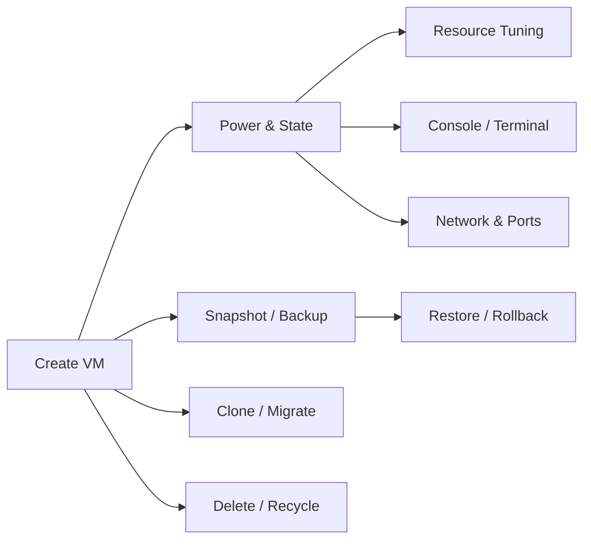

# Virtual Machine Management Tutorial

Virtual machine management is the core feature of OpenIDCS. This tutorial covers the full lifecycle operations in the web console — **creation, runtime control, resource tuning, backup, migration and recycling** — and shows the equivalent REST API calls.

::: tip Scope
This tutorial applies to every supported virtualization platform (VMware Workstation / vSphere ESXi / LXC/LXD / Docker/Podman / Proxmox VE / Windows Hyper-V / Qingzhou Cloud). Platform-specific differences are flagged inline.
:::

## Feature Overview



| Capability | Description | Menu |
|------|------|----------|
| Create | Provision from template / ISO / image | VM Management → Create VM |
| Lifecycle | Start / Stop / Reboot / Suspend / Force off | VM detail page |
| Reconfigure | CPU / Memory / Disk / NIC | VM detail → Config |
| Console | VNC / SSH / Web Terminal | VM detail → Console |
| Snapshot | Create / Rollback / Delete | VM detail → Snapshot |
| Backup | Full / Differential / Restore | VM detail → Backup |
| Clone | Full clone / Linked clone | VM detail → Clone |
| Migrate | Cross-host / Cross-platform | VM detail → Migrate |
| Bulk ops | Batch start / stop / delete | VM list page |

## Creating a Virtual Machine

### Via the Web UI

1. Log in to OpenIDCS and go to **VM Management → Create VM**.
2. Follow the wizard:

    | Category | Field | Description |
    |------|------|------|
    | Basic | Name | Letters, digits, underscores, dashes only; globally unique |
    | Basic | Host | Pick a registered agent host |
    | Basic | OS | Select image/template; for containers, select an image tag |
    | Resource | vCPU | Integer; must be ≤ user quota |
    | Resource | Memory (MB) | Must be ≤ user quota; some platforms require a power of two |
    | Resource | Disk (GB) | System disk size; data disks can be added later |
    | Network | Bridge | Pick a public/NAT bridge defined on the host |
    | Network | IP | Auto-allocate from pool, or static |
    | Network | MAC | Leave empty to auto-generate |
    | Auth | Initial password | Can be rotated later via the password reset action |

3. Click **Create** and watch progress from the list page.

### Via REST API

```bash
curl -X POST http://localhost:1880/api/vm/create \
  -H "Content-Type: application/json" \
  -H "Authorization: Bearer <Token>" \
  -d '{
    "host_name": "docker-01",
    "vm_name": "web-01",
    "os_template": "ubuntu:22.04",
    "vcpu": 2,
    "memory": 2048,
    "disk": 20,
    "network": {
      "bridge": "docker-nat",
      "ip": "auto"
    },
    "password": "Strong@Pass123"
  }'
```

Sample response:

```json
{
  "code": 0,
  "msg": "ok",
  "data": { "task_id": "T-20260424-0001", "vm_id": "web-01" }
}
```

### Bulk Creation (Template Clone)

Inside **VM Management → Bulk Create**:

1. Pick an existing VM or template as the source.
2. Set the count (e.g. `5`) and a naming rule (e.g. `web-{n}`).
3. Configure a starting IP — the system auto-increments.
4. After submitting you can track per-instance progress in **Task Center**.

## Power & State Management

| Action | Description | When to use |
|------|------|----------|
| Start | Normal power on | Routine startup |
| Shutdown | Send ACPI signal; graceful OS shutdown | Recommended shutdown |
| Force off | Immediate power cut; data may be lost | When the guest is frozen |
| Reboot | Soft reboot | Apply configuration |
| Suspend | Hibernate running state to disk | Short-term CPU release |
| Resume | Continue from suspended state | Paired with Suspend |

::: warning Platform Differences
- LXC/LXD and Docker/Podman do not support suspend/resume — these fall back to stop/start.
- Hyper-V **SaveState** behaves like suspend.
- Qingzhou Cloud is driven by vendor APIs and some ops have a 10–30s asynchronous delay.
:::

### Bulk Power Operations

Select multiple instances on the VM list page, click **Bulk → Start / Stop / Reboot**. An asynchronous task is created and per-instance results are tracked in the Task Center.

## Resource Tuning

### Hot-plug Support

| Platform | CPU | Memory | Disk | NIC |
|------|-----|------|------|------|
| VMware Workstation | ❌ Requires shutdown | ❌ Requires shutdown | ✅ | ✅ |
| vSphere ESXi | ✅ (needs CPU Hot-Add) | ✅ | ✅ | ✅ |
| Proxmox VE | ✅ | ✅ (ballooning) | ✅ | ✅ |
| Hyper-V | ❌ Shutdown (except Dynamic Memory) | ✅ (Dynamic Memory) | ✅ | ✅ |
| LXC/LXD | ✅ | ✅ | ✅ | ✅ |
| Docker/Podman | ❌ Rebuild | ❌ Rebuild | ⚠️ Volumes only | ❌ |

### Disk Operations

- **Expand**: Detail page → **Disks** → pick disk → **Expand**, enter new size. After expansion run `growpart` + `resize2fs` / `xfs_growfs` inside the guest.
- **Mount ISO**: Detail page → **CD/DVD** → **Mount ISO**, pick an ISO from the image library.
- **Add data disk**: Detail page → **Disks** → **Add Disk**, choose thin/thick provisioning.
- **Disk migration**: VMware/Proxmox can migrate a disk between datastores without downtime.

## Console Access

### Web VNC

1. Open the VM detail page, switch to the **Console** tab.
2. A Websockify tunnel is established automatically; interact with the GUI directly in the browser.
3. Full-screen, **Ctrl+Alt+Del**, and clipboard sync are all supported.

### SSH / Web Terminal

- **SSH direct connect**: Detail page → **Terminal**. The backend opens a session via `SSHDManager` — the guest SSH port is never exposed publicly.
- **Web Terminal (ttyd)**: For container hosts you can install ttyd and use the **Container Terminal** tab with no SSH key.

### RDP (Windows VMs)

1. In **Network → Port Forwarding**, map host port (e.g. `13389`) to guest `3389`.
2. Connect with `mstsc` / Remmina to `HOST_IP:13389`.

## Snapshots & Backup

### Snapshots

A snapshot captures disk + memory at a point in time — ideal as a **temporary rollback point**.

```bash
# Create
POST /api/vm/{vm_id}/snapshot
{ "name": "before-upgrade", "desc": "Pre-upgrade" }

# Rollback
POST /api/vm/{vm_id}/snapshot/{snap_id}/restore

# Delete
DELETE /api/vm/{vm_id}/snapshot/{snap_id}
```

::: warning Caution
- Keeping too many snapshots increases disk overhead and I/O penalty; stay ≤ 5 per VM.
- Containers (Docker/LXC) usually only support disk snapshots, not memory ones.
:::

### Backup

A backup exports the instance to a self-contained file that can be restored on any host.

| Type | Feature | Suggested Frequency |
|------|------|----------|
| Full | Full disk + config export | Weekly |
| Differential | Changed blocks only | Daily |
| External | Target NFS/S3/remote storage | DR scenarios |

Steps:

1. Detail page → **Backup** → **Create Backup**.
2. Pick the backup type and target (local / NFS / S3).
3. Restore, list and delete past backups from **Backup List**.

## Clone & Migration

### Clone

- **Full clone**: Fully independent copy — the source is untouched.
- **Linked clone**: Shares the base disk via a snapshot — lightweight but depends on the source.

### Migration

| Type | Platforms | Downtime |
|----------|----------|----------|
| Cold migration | All | Minutes |
| Live migration (vMotion/Live) | ESXi / Proxmox / LXD | Seconds |
| Cross-platform | Via backup + restore | Minutes |

## Deletion & Recycling

1. Detail page → **Delete Instance**, tick the desired options:
   - ☑ Delete disk files
   - ☑ Release IP
   - ☑ Delete related snapshots/backups
2. Use **Recycle Bin** (7-day retention) to undo accidental deletes.
3. After the retention period, data is purged permanently.

## FAQ

### "Quota exceeded" when creating

Go to **User Management → Quota** and review the current user's CPU/memory/disk/count usage. An admin must raise the limit. See [User Management](/en/tutorials/user-management) and [Permissions](/en/tutorials/permissions).

### VM stays in "starting" state

1. Inspect the related task's error message in **Task Center**.
2. Check `vm.log` in **Log Management**, filtering by `vm_id`. See [Logs](/en/tutorials/logs).
3. On the agent host, run the native command (`docker ps`, `lxc list`, `vmrun list`, ...) to cross-check the state.

### VNC console black screen

- Make sure the guest has fully booted (a cold start may need 30s+).
- For LXC/Docker (no GUI), use the **Terminal** tab instead.
- Check that Websockify is healthy (main host `log-ws.log`).

## See Also

- [Feature Overview](/en/guide/features)
- [User Management](/en/tutorials/user-management)
- [Permissions](/en/tutorials/permissions)
- [Network & Ports](/en/tutorials/network)
- [Backup & Restore](/en/tutorials/backup)
- [Logs & Audit](/en/tutorials/logs)
