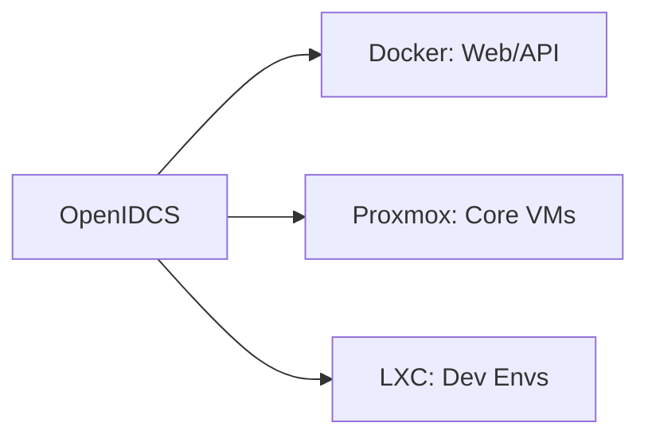

# Virtualization Platform Comparison

OpenIDCS supports **7 mainstream virtualization / container platforms**. This page helps you pick the right one for your scenario.

## 🧭 One-Liner Recommendation

| Goal | Recommended Platform |
|---|---|
| 🐳 Deploy web / microservices / CI environments, fastest startup | **Docker / Podman** |
| 📦 Run full Linux distros without VM overhead | **LXC / LXD** |
| 🖥️ Desktop-level dev/test, need Windows / custom ISO | **VMware Workstation** |
| 🏢 Enterprise production, need HA / cluster / storage migration | **Proxmox VE** / **VMware ESXi** |
| 🪟 Pure Windows Server environment, no 3rd-party components | **Windows Hyper-V** |
| ☁️ Integrate existing Qingzhou / QingCloud resources | **Qingzhou** |

## 📋 Capability Matrix

### Basic Capabilities

| Platform | Type | Overhead | Boot Speed | Supported OS |
|----------|------|----------|------------|--------------|
| **Docker / Podman** | App container | Very Low | Seconds | Linux (inside container) |
| **LXC / LXD** | System container | Very Low | Seconds | Linux |
| **VMware Workstation** | Type-2 Hypervisor | Medium | 10–30s | All OS |
| **VMware ESXi** | Type-1 Hypervisor | Low | 10–30s | All OS |
| **Proxmox VE** | KVM + LXC | Low | 5–20s | All OS |
| **Windows Hyper-V** | Type-1 Hypervisor | Low | 10–30s | All OS |
| **Qingzhou** | Public Cloud API | - | - | All OS |

### Feature Support Matrix

Based on actual adapters in OpenIDCS `HostServer`:

| Feature | Docker/OCI | LXC/LXD | VMware WS | Proxmox | Hyper-V | ESXi | Qingzhou |
|---------|:--:|:--:|:--:|:--:|:--:|:--:|:--:|
| VM Lifecycle | ✅ | ✅ | ✅ | ✅ | ✅ | ✅ | ✅ |
| Change Password `VMPasswd` | ✅* | ✅* | ✅ | ✅ | ✅ | ✅ | ✅ |
| Screenshot `VMScreen` | ❌ | ❌ | ✅ | ✅ | ✅ | ✅ | ✅ |
| Backup / Restore | ✅ | ✅ | ✅ | ✅ | ✅ | ✅ | ✅ |
| List / Delete Backup | ✅ | ✅ | ✅ | ⚠️ | ✅ | ✅ | ✅ |
| Disk Mount / Unmount | ✅ | ✅ | ✅ | ✅ | ✅ | ✅ | ✅ |
| ISO Mount | ✅ | ❌ | ✅ | ✅ | ✅ | ✅ | ✅ |
| Disk Check | ❌ | ❌ | ✅ | ✅ | ❌ | ✅ | ❌ |
| Disk Migration | ❌ | ❌ | ✅ | ✅ | ❌ | ❌ | ❌ |
| PCI Passthrough | ✅ | ❌ | ✅ | ✅ | ✅ | ✅ | ❌ |
| USB Passthrough | ❌ | ❌ | ✅ | ✅ | ❌ | ✅ | ❌ |
| VNC Console | ❌ | ❌ | ✅ | ✅ | ✅ | ✅ | ✅ |
| Web Terminal (ttyd) | ✅ | ✅ | ❌ | ❌ | ❌ | ❌ | ❌ |

> Note: `*` means changed via agent / external method; `⚠️` means partially supported.

### Isolation Strength

```
Docker/Podman  ───────────●─────────────────→ Light (shared kernel)
LXC/LXD        ────────────●────────────────→ Medium (shared kernel + cgroup)
Hyper-V/ESXi   ────────────────────●────────→ Strong (hardware virtualization)
VMware WS/PVE  ────────────────────●────────→ Strong (hardware virtualization)
Qingzhou       ────────────────────────●────→ Multi-tenant isolation
```

## 🎯 Typical Scenarios

### Scenario 1: SMB IT, Hybrid Environment

Recommended: **Docker (container services) + Proxmox (core VMs)**



### Scenario 2: IDC Transitioning to Virtualization Sales

Recommended: **Proxmox + LXD**

- Proxmox for KVM VMs (sold to users needing full Linux / Windows)
- LXD for container plans (cheaper, higher density)
- OpenIDCS integrates with zjmf billing for automatic provisioning / suspend / renewal

### Scenario 3: R&D / Education

Recommended: **VMware Workstation (local)** or **LXC / LXD (lightweight)**

- Workstation: students can snapshot/rollback anytime, run Windows labs
- LXC: 3–5x higher density on the same hardware

### Scenario 4: Pure Windows Server

Recommended: **Hyper-V**

- No 3rd-party hypervisor needed
- Deeply integrated with AD / WinRM / PowerShell
- OpenIDCS manages it via PS scripts

## 🏗️ Architecture Differences

### Idle Resource Footprint

| Platform | Memory | CPU | Disk |
|----------|--------|-----|------|
| Docker Engine | ~100 MB | <1% | ~500 MB |
| LXD | ~150 MB | <1% | ~300 MB |
| VMware Workstation | ~400 MB | 1–3% | ~2 GB |
| Proxmox VE | ~800 MB | 1–3% | ~4 GB |
| Hyper-V | ~500 MB | 1–2% | ~3 GB |
| ESXi | ~1.5 GB | 2–5% | Dedicated |

### Management Protocols

| Platform | Protocol | Port | Auth |
|----------|----------|------|------|
| Docker / Podman | HTTPS (REST) | 2376 | Mutual TLS |
| LXC / LXD | HTTPS (REST) | 8443 | Mutual TLS |
| VMware Workstation | HTTPS (REST) | 8697 | Basic Auth |
| Proxmox VE | HTTPS (REST) | 8006 | Token / PAM |
| Hyper-V | WinRM (PS) | 5985/5986 | NTLM / Kerberos |
| ESXi | HTTPS (SOAP) | 443 | vSphere account |
| Qingzhou | HTTPS (REST) | 443 | AccessKey |

## 📖 Detailed Configuration Docs

- 🐳 [Docker / Podman](/en/vm/docker)
- 📦 [LXC / LXD](/en/vm/lxd)
- 🖥️ [VMware Workstation](/en/vm/vmware)
- 🏢 [Proxmox VE](/en/vm/proxmox)
- 🌐 [VMware vSphere ESXi](/en/vm/esxi)
- 🪟 [Windows Hyper-V](/en/vm/hyperv)
- ☁️ [Qingzhou](/en/vm/qingzhou)

## Next

- 📖 Read [Introduction](/en/guide/introduction) to understand OpenIDCS positioning
- 🚀 Pick a platform and jump to its doc to [Quick Start](/en/guide/quick-start)
