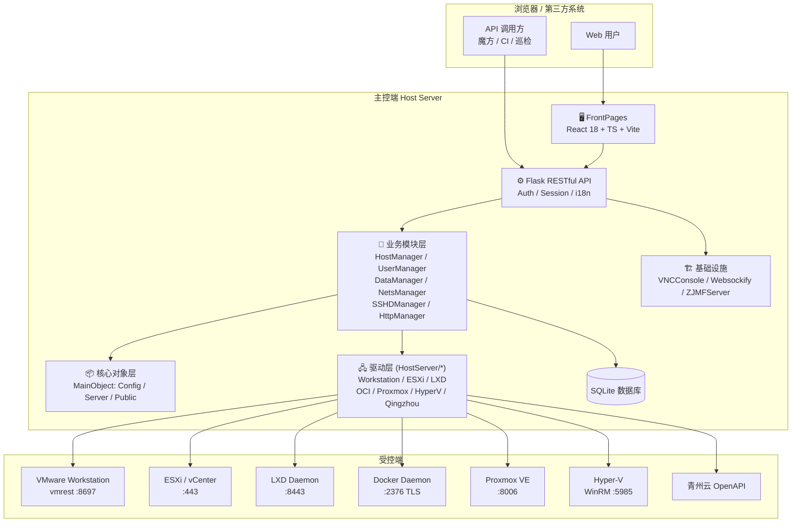
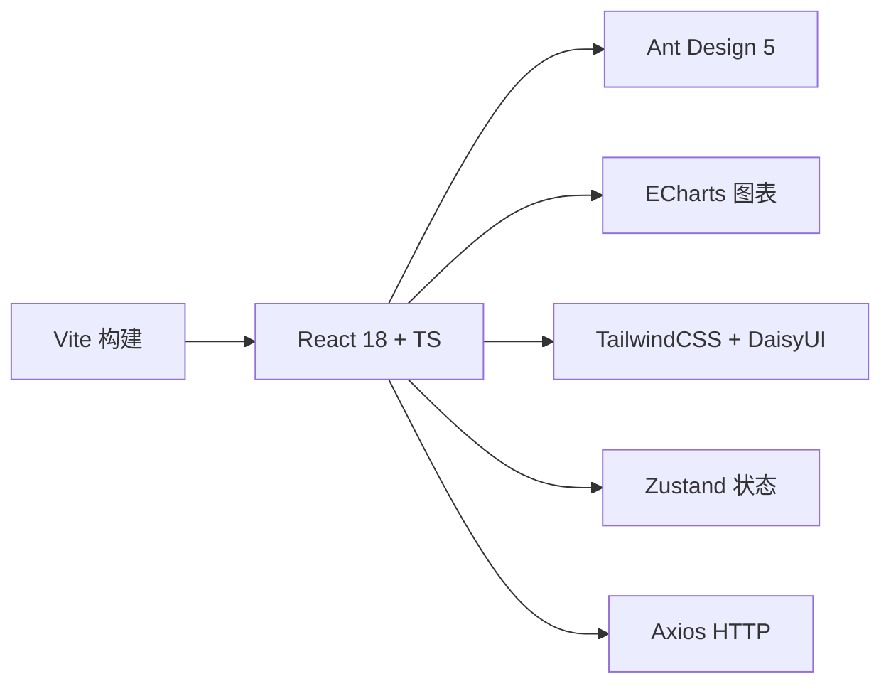
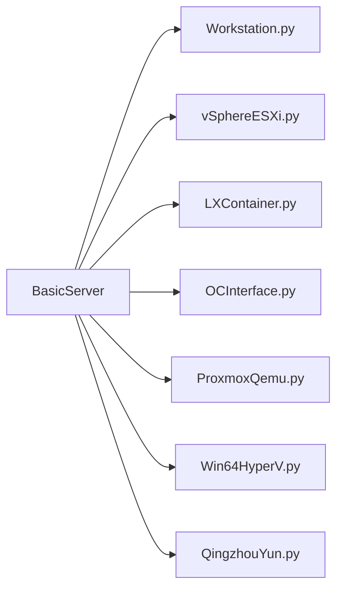
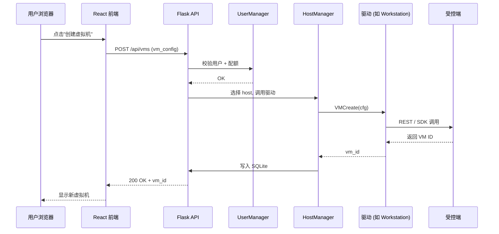
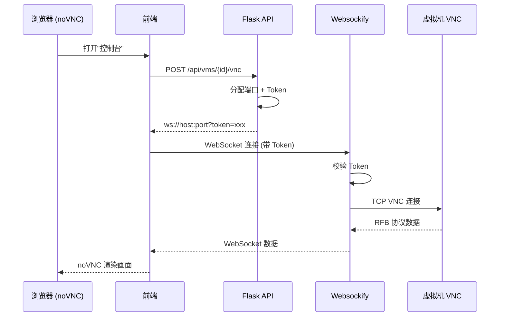
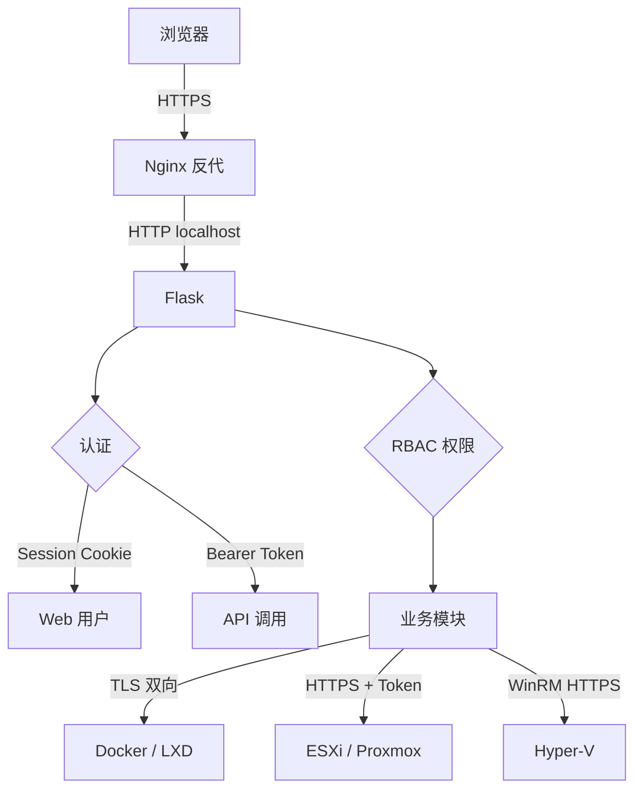

# 架构设计

本文档从整体架构、分层设计、核心模块、数据流、关键流程等角度，系统说明 OpenIDCS 的内部实现。

## 整体架构

OpenIDCS 采用**前后端分离 + 插件化驱动 + 受控端 Agent**的经典三段式架构：



## 分层说明

### 1. 前端层（FrontPages）

- **技术栈**：React 18 + TypeScript + Vite + Ant Design 5 + ECharts + TailwindCSS + DaisyUI + Zustand
- **职责**：页面渲染、状态管理、i18n、主题、图表、VNC/SSH 控制台
- **打包产物**：生产时被后端 Flask 作为静态资源托管



### 2. 应用层（Flask）

- **入口文件**：`HostServer.py` / `MainServer.py`
- **职责**：
  - HTTP 路由 / REST 接口注册
  - Token + Session 双认证
  - i18n（`HostConfig/translates/`）
  - 静态资源托管
  - WebSocket 升级（VNC / SSH）

### 3. 业务模块层（HostModule）

| 模块 | 职责 |
|------|------|
| `HostManager` | 管理所有受控主机，负责驱动实例化与生命周期 |
| `RestManager` | 所有 REST 路由的统一入口 |
| `UserManager` | 用户、角色、RBAC、配额 |
| `DataManager` | SQLite 数据持久化 |
| `NetsManager` | IP 池、NAT、iptables 规则 |
| `HttpManager` | Web 反向代理（域名绑定） |
| `SSHDManager` | Web SSH 终端会话管理 |
| `Translation` | 后端翻译字典 |

### 4. 核心对象层（MainObject）

所有配置与运行时状态被建模为 **强类型对象**：

- `Config/`：`VMConfig`、`HSConfig`、`HostsConfig`、`UserConfig`、`NetConfig` 等
- `Server/`：`HSEngine`（引擎）、`HSStatus`（状态机）、`HSTasker`（任务调度）
- `Public/`：`HWStatus`（硬件监控）、`ZMessage`（消息总线）

### 5. 驱动层（HostServer）

**驱动层是 OpenIDCS 的灵魂**。所有虚拟化平台都继承自统一的 `BasicServer` 抽象类：

```python
class BasicServer:
    def HSLoader(self): ...            # 连接受控端
    def VMCreate(self, cfg): ...       # 创建虚拟机
    def VMPowers(self, id, op): ...    # 电源操作
    def VMPasswd(self, id, pwd): ...   # 改密
    def VMScreen(self, id): ...        # 截图
    def VMBackup(self, id): ...        # 备份
    def Restores(self, id, bk): ...    # 还原
    def HDDMount(self, id, disk): ...  # 挂盘
    def ISOMount(self, id, iso): ...   # 挂 ISO
    # ... 统一接口，所有驱动实现
```

目前已实现的驱动：



**优点**：新增平台只需实现接口，业务层和前端**零改动**即可使用。

### 6. 基础设施层

| 模块 | 说明 |
|------|------|
| `VNCConsole/VNCSManager.py` | 为每个虚拟机分配 VNC 会话并维护 |
| `Websockify/` | 将 TCP VNC 流转换为 WebSocket，供浏览器 noVNC 使用 |
| `ZJMFServer/` | 魔方财务 SwapIDC / IDCSmart 对接服务端 |

## 核心数据流：创建一台虚拟机



## VNC / SSH 远程访问流程



## 数据持久化

- **引擎**：SQLite（`DataSaving/database.db`）
- **特点**：单文件、零依赖、足够支撑数百台主机 / 数千虚拟机
- **表结构**：用户、角色、主机、虚拟机、IP 池、NAT 规则、Web 代理、快照、备份、操作日志

对于超大规模部署，后续会考虑可选的 MySQL / PostgreSQL 后端。

## 多语言 i18n

- 前端：`FrontPages/src/utils/i18n.ts`（React i18next）
- 后端：`HostConfig/translates/`（YAML）
- 支持：中文、English，可通过界面右上角切换

## 安全设计



- 所有受控端通信均支持加密（TLS / HTTPS / WinRM-HTTPS）
- 主控端对外建议通过 Nginx + HTTPS
- 敏感字段（密码、Token）在 SQLite 中加密存储
- 操作日志记录调用者 IP、用户、动作、结果

## 构建与打包

| 方式 | 命令 | 适用 |
|------|------|------|
| 开发运行 | `python HostServer.py` | 开发 / 调试 |
| Nuitka | `cd AllBuilder && build_nuitka.bat` | 生产打包，启动快 |
| cx_Freeze | `python HostBuilds.py build` | 跨平台打包 |
| Docker | 见 [主控端配置](/config/server) | 容器化部署 |

## 目录结构速查

```
OpenIDCS-Client/
├── FrontPages/      # React 前端
├── HostServer/      # 驱动层（各虚拟化平台）
├── HostModule/      # 业务模块
├── MainObject/      # 核心对象
├── VNCConsole/      # VNC 管理
├── Websockify/      # WebSocket 代理
├── ZJMFServer/      # 魔方财务对接
├── HostConfig/      # 配置与脚本（含 setups-*.sh）
├── DataSaving/      # 数据 + 日志
├── AllBuilder/      # 构建脚本
└── HostServer.py    # 主程序入口
```

## 扩展性设计

### 新增虚拟化平台

只需 3 步：

1. 在 `HostServer/` 下新建 `YourPlatform.py`，继承 `BasicServer`
2. 实现 `HSLoader()`、`VMCreate()`、`VMPowers()` 等核心方法
3. 在 `HostManager` 的类型字典注册

**前端无需改动**（通用 UI 会自动适配）。

### 新增业务功能

- 新增 REST 接口：在 `HostModule/RestManager.py` 注册蓝图
- 新增前端页面：在 `FrontPages/src/pages/` 创建组件

## 下一步

- 📖 查看 [功能概览](/guide/features) 了解具体功能清单
- 🚀 查看 [快速上手](/guide/quick-start) 部署试用
- 🔧 查看 [主控端配置](/config/server) 了解部署细节
