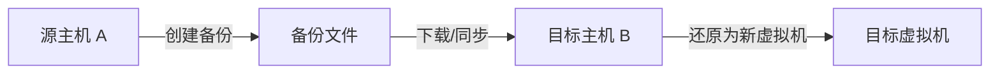

# 备份与快照

OpenIDCS 为虚拟机提供了快照（Snapshot）与完整备份（Backup）两种数据保护机制，帮助您在误操作、系统损坏或迁移场景下快速恢复数据。

## 概念对比

| 维度 | 快照 (Snapshot) | 备份 (Backup) |
|------|-----------------|---------------|
| **存储位置** | 与原虚拟机共用存储池 | 独立的备份目录（可挂载远程存储） |
| **创建速度** | 秒级（写时复制） | 取决于虚拟机大小，通常分钟~小时 |
| **占用空间** | 增量存储，初期极小 | 完整拷贝，与原虚拟机相当 |
| **原虚拟机删除** | 快照随之失效 | 备份独立存在，可用于重建 |
| **主要用途** | 升级前回滚点、临时测试 | 长期归档、灾难恢复、跨主机迁移 |
| **推荐频率** | 关键操作前手动创建 | 每日/每周定时执行 |

::: tip 最佳实践
快照适合**短期**保护（例如系统更新前），备份适合**长期**保护（例如业务数据归档）。两者应结合使用，不要用快照替代备份。
:::

## 平台支持矩阵

| 平台 | 快照 | 备份 | 还原 | 列出备份 | 删除备份 |
|------|:----:|:----:|:----:|:--------:|:--------:|
| VMware Workstation | ✅ | ✅ | ✅ | ✅ | ✅ |
| VMware vSphere ESXi | ✅ | ✅ | ✅ | ✅ | ✅ |
| LXC / LXD | ✅ | ✅ | ✅ | ✅ | ✅ |
| Docker / Podman | ✅（Commit） | ✅ | ✅ | ✅ | ✅ |
| Proxmox VE | ✅ | ✅ | ✅ | ⚠️ 节点本地 | ⚠️ 节点本地 |
| Windows Hyper-V | ✅ | ✅ | ✅ | ✅ | ✅ |
| 青州云 | ✅ | ✅ | ✅ | ✅ | ✅ |

## 快照管理

### 创建快照

1. 进入 **虚拟机管理** → 选择目标虚拟机 → **详情**
2. 切换到 **快照** 标签
3. 点击 **创建快照**，填写：
   - **快照名称**：例如 `pre-upgrade-2026-04-24`
   - **描述**：记录创建原因
   - **包含内存**：是否保留运行时内存（仅开机状态可选）
4. 点击 **确定**

::: warning 注意
- 创建内存快照时虚拟机会短暂冻结几秒
- VMware/ESXi/Hyper-V 支持多层快照树；Docker commit 为扁平镜像层
:::

### 恢复快照

1. 在快照列表中选中目标快照
2. 点击 **恢复到此快照**
3. 系统会自动关闭虚拟机 → 回滚磁盘状态 → 重新启动

::: danger 数据丢失风险
恢复快照会**丢弃**创建快照之后的所有磁盘改动，请先对重要数据做备份。
:::

### 删除快照

- **删除单个**：释放该层增量空间
- **全部合并**：将所有快照合并到当前磁盘（仅 VMware/ESXi）

::: tip
生产环境中单台虚拟机的快照**不建议超过 3 个**，否则会显著降低磁盘 I/O 性能。
:::

### 快照命名规范（建议）

```
<操作类型>-<日期>-<说明>
# 示例
pre-upgrade-20260424-kernel
before-patch-20260424-cve
daily-auto-20260424
```

## 完整备份

### 手动备份

1. 进入虚拟机详情 → **备份** 标签
2. 点击 **创建备份**
3. 填写参数：

| 参数 | 说明 | 建议 |
|------|------|------|
| 备份名称 | 备份文件名前缀 | 使用有含义的名称 |
| 备份描述 | 备注信息 | 记录业务状态 |
| 压缩等级 | 0（不压缩）~9（最高） | 推荐 6，平衡速度与空间 |
| 包含快照 | 是否一并打包快照 | 生产备份建议包含 |
| 关机备份 | 是否先关机再备份 | 数据库类虚拟机建议开启 |

4. 点击 **开始备份**，在 **任务中心** 查看进度

### 备份列表管理

在 **备份** 标签可以看到：

| 字段 | 含义 |
|------|------|
| 备份 ID | 唯一标识 |
| 创建时间 | 开始时间 |
| 大小 | 压缩后体积 |
| 状态 | 完成 / 进行中 / 失败 |
| 操作 | 还原 / 下载 / 删除 |

### 还原备份

1. 选择要还原的备份，点击 **还原**
2. 选择还原模式：
   - **覆盖原虚拟机**：直接回滚当前虚拟机
   - **还原为新虚拟机**：以新名称/新 IP 创建（用于测试验证）
3. 确认后在任务中心查看进度

::: warning 覆盖还原会丢失当前数据
覆盖还原会清空当前虚拟机的全部磁盘数据，请提前确认。
:::

### 下载备份

点击 **下载** 将备份打包文件拉取到本地，通常为：
- `.tar.gz`（LXD / Docker）
- `.ova` / `.vmdk`（VMware / ESXi）
- `.vhdx`（Hyper-V）
- `.vma.zst`（Proxmox）

## 定时备份策略

### 创建定时任务

1. 进入 **系统设置** → **定时任务**
2. 点击 **新建任务**，选择 **类型：备份**
3. 配置策略：

```yaml
任务名称: daily-backup-prod
目标:
  - 标签：env=production
  - 或指定虚拟机列表
触发时间: Cron 表达式，例如 "0 2 * * *"（每天凌晨 2 点）
压缩等级: 6
保留策略:
  - 保留最近 7 天每日备份
  - 保留最近 4 周每周备份
  - 保留最近 12 个月每月备份
通知: 成功/失败均发送邮件
```

4. 保存后任务会自动加入调度队列

### 3-2-1 备份原则（推荐）

```
3 份数据副本（1 份生产 + 2 份备份）
2 种不同存储介质（本地磁盘 + 对象存储）
1 份异地副本（远程机房 / 云存储）
```

### 异地备份配置

通过 **系统设置** → **存储** 挂载远程目标：

| 类型 | 配置项 |
|------|--------|
| NFS | 服务器地址、导出路径、挂载点 |
| SMB/CIFS | 服务器地址、共享名、用户名密码 |
| S3 兼容 | Endpoint、Bucket、AK/SK |
| SFTP | 主机、端口、用户名、私钥 |

挂载后在定时任务中勾选 **同步到远程存储** 即可。

## 跨主机迁移

利用备份可实现跨虚拟化平台或跨主机的迁移：



### 操作步骤

1. 在源虚拟机创建完整备份（建议关机备份保证一致性）
2. 下载备份文件到主控端
3. 在目标主机上传备份 → **还原为新虚拟机**
4. 还原后调整网络配置（IP / 网桥）

::: tip
跨**同类平台**（如 VMware→VMware）可直接还原。跨**不同平台**（如 VMware→KVM）需要先转换磁盘格式，例如 `qemu-img convert -f vmdk -O qcow2 src.vmdk dst.qcow2`。
:::

## 备份验证

定期测试备份可还原至关重要。推荐每月执行一次：

1. 从生产备份挑选 1-2 个代表性虚拟机
2. 使用 **还原为新虚拟机** 模式恢复到隔离主机
3. 启动虚拟机，验证：
   - 操作系统是否正常启动
   - 关键服务是否可用
   - 数据完整性（数据库行数、文件 MD5）
4. 验证完成后删除测试虚拟机

## API 调用示例

### 创建备份

```bash
curl -X POST http://localhost:1880/api/vms/{vm_id}/backup \
  -H "Authorization: Bearer YOUR_TOKEN" \
  -H "Content-Type: application/json" \
  -d '{
    "name": "manual-20260424",
    "description": "release v2.1 upgrade",
    "compress": 6,
    "include_snapshots": true
  }'
```

### 列出备份

```bash
curl http://localhost:1880/api/vms/{vm_id}/backups \
  -H "Authorization: Bearer YOUR_TOKEN"
```

### 还原备份

```bash
curl -X POST http://localhost:1880/api/vms/{vm_id}/restore \
  -H "Authorization: Bearer YOUR_TOKEN" \
  -H "Content-Type: application/json" \
  -d '{"backup_id": "bak_20260424_020000", "mode": "overwrite"}'
```

## 故障排查

| 现象 | 可能原因 | 解决方案 |
|------|----------|----------|
| 备份任务长时间卡住 | 磁盘 I/O 繁忙 | 错峰执行、限制并发备份数 |
| 备份大小异常大 | 虚拟磁盘内存在大量零空间 | 启用稀疏备份、定期 `fstrim` |
| 还原后无法启动 | 磁盘格式不兼容 | 使用 `qemu-img` 转换格式 |
| 快照数量达上限 | 平台限制（如 VMware 32 层） | 合并旧快照 |
| 远程存储同步失败 | 网络/证书问题 | 检查挂载、查看任务日志 |

## 相关文档

- 📋 [虚拟机管理](/tutorials/vm-management)
- 📊 [监控与告警](/tutorials/monitoring)
- 📝 [日志管理](/tutorials/logs)
- ⚙️ [主控端配置](/config/server)
