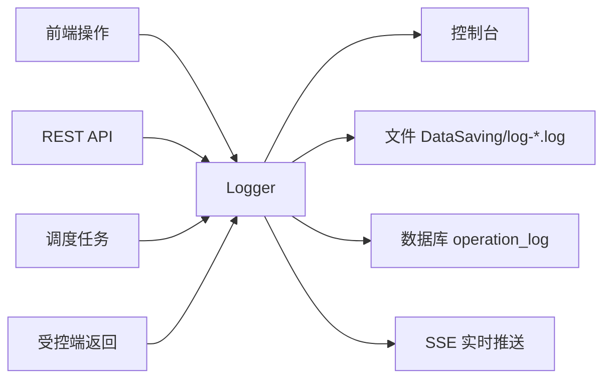

# 日志管理使用教程

OpenIDCS 为所有关键路径记录了结构化日志，并提供 Web 查询、文件留存、实时订阅、导出归档等能力。本教程介绍日志体系、查询方式、告警配置以及在故障排查中的实用技巧。

## 日志体系总览



| 日志类别 | 内容 | 存储位置 | 访问入口 |
|----------|------|----------|----------|
| 操作日志（Operation）| 用户对虚拟机/主机/用户等资源的增删改查 | 数据库 `operation_log` | **日志管理 → 操作日志** |
| 审计日志（Audit）| 登录、权限、Token 等敏感事件 | 数据库 `audit_log` | **日志管理 → 审计日志** |
| 系统日志（System）| Flask/Loguru 运行时输出 | `DataSaving/log-main.log` | **日志管理 → 系统日志** |
| 任务日志（Task）| 异步任务调度过程 | `DataSaving/log-task.log` | **任务中心 → 任务详情** |
| 访问日志（Access）| HTTP 请求记录 | `DataSaving/log-access.log` | **日志管理 → 访问日志** |
| 安全日志（Security）| 登录失败、异常 IP、越权尝试 | `DataSaving/log-security.log` | **日志管理 → 安全日志** |

::: tip 文件命名
所有文件日志均放在 `DataSaving/` 目录，使用 [Loguru](https://github.com/Delgan/loguru) 管理，支持大小/时间轮转与压缩。
:::

## 查询日志

### 通用查询筛选

**日志管理** 页面支持：

| 过滤项 | 说明 |
|--------|------|
| 时间范围 | 最近 15 分钟 / 1 小时 / 24 小时 / 自定义 |
| 级别 | DEBUG / INFO / WARNING / ERROR / CRITICAL |
| 用户 | 按用户名过滤 |
| 模块 | VM / Host / User / Net / Auth / System |
| 关键字 | 支持全文检索，可用双引号匹配短语 |
| 对象 ID | 针对某台虚拟机/主机快速检索 |
| 结果 | 成功 / 失败 / 异常 |

### 操作日志示例

| 时间 | 用户 | 模块 | 操作 | 对象 | 结果 | 耗时 |
|------|------|------|------|------|------|------|
| 2026-04-24 10:05:12 | alice | VM | create | `web-01` | 成功 | 3.2s |
| 2026-04-24 10:07:33 | alice | VM | power-on | `web-01` | 成功 | 0.9s |
| 2026-04-24 10:15:48 | bob | User | reset-password | `alice` | 拒绝：权限不足 | 0.1s |

### 审计日志示例

```
[2026-04-24 09:30:11] LOGIN      success  user=alice  ip=10.1.1.5
[2026-04-24 09:31:02] TOKEN      create   user=alice  name=ci-deploy ttl=90d
[2026-04-24 09:40:27] LOGIN      fail     user=eve    ip=203.0.113.7 reason=bad_password
[2026-04-24 10:15:48] PERMISSION deny     user=bob    action=user:update target=alice
```

### 实时订阅

在 **日志管理 → 实时** 页签：

1. 选择感兴趣的模块与级别。
2. 点击 **开始订阅**，后端通过 SSE 推送最新日志。
3. 支持暂停/继续、高亮关键字、导出当前缓冲区。

相当于 `tail -f` 的 Web 版，非常适合联调与故障复现。

## 导出与归档

### Web 导出

在查询结果页顶部点击 **导出**：

- **CSV**：适合在 Excel 中分析
- **JSON**：保留完整结构化字段
- **压缩包**：包含指定时间段的所有文件日志

### 文件留存策略

默认在 `DataSaving/` 下：

```
log-main.log            当前主日志
log-main.2026-04-23.log.zip   轮转后的历史
log-access.log          访问日志
log-task.log            任务日志
log-security.log        安全日志
```

可在 `.env` 中调整：

```ini
LOG_LEVEL=INFO
LOG_ROTATION=10 MB    # 文件达到 10MB 后轮转
LOG_RETENTION=30 days # 保留 30 天
LOG_COMPRESSION=zip   # 归档压缩格式
```

### 归档到外部系统

推荐对接 ELK / Loki / Splunk 等系统，以便长期留存与聚合分析。

#### 方案 1：Filebeat + Elasticsearch

```yaml
# filebeat.yml
filebeat.inputs:
  - type: log
    paths:
      - /opt/OpenIDCS-Client/DataSaving/log-*.log
    json.keys_under_root: true
    json.add_error_key: true

output.elasticsearch:
  hosts: ["http://elk:9200"]
  index: "openidcs-%{+yyyy.MM.dd}"
```

#### 方案 2：Promtail + Loki

```yaml
scrape_configs:
  - job_name: openidcs
    static_configs:
      - targets: [localhost]
        labels:
          job: openidcs
          __path__: /opt/OpenIDCS-Client/DataSaving/log-*.log
```

## 告警与通知

### 告警规则

在 **日志管理 → 告警规则** 中创建：

| 字段 | 示例 | 说明 |
|------|------|------|
| 名称 | `login-bruteforce` | 规则标识 |
| 条件 | 同一 IP 10 分钟内登录失败 ≥ 10 次 | 聚合表达式 |
| 级别 | WARNING | 用于分级通知 |
| 动作 | 禁用 IP / 发送邮件 / Webhook | 可组合 |
| 冷却 | 30 分钟 | 避免告警风暴 |

### 常用规则模板

- **暴力破解**：同一用户/IP 短时间内大量 `LOGIN fail`
- **越权尝试**：同一用户短时间内多次 `PERMISSION deny`
- **异常删除**：单次操作删除 > 10 台虚拟机
- **配额耗尽**：用户配额使用率 > 95%
- **主机掉线**：`Host unreachable` 持续 > 2 分钟

### 通知渠道

| 渠道 | 配置位置 | 说明 |
|------|----------|------|
| 邮件 | 系统配置 → 邮件 SMTP | 支持 HTML 模板 |
| Webhook | 告警规则 → 动作 → Webhook | 兼容飞书/钉钉/企业微信机器人 |
| 站内信 | 默认启用 | 登录后弹出铃铛提醒 |
| Syslog | `.env` 中 `SYSLOG_HOST` | 适合对接企业 SOC |

#### 飞书机器人 Webhook 示例

```bash
curl -X POST "https://open.feishu.cn/open-apis/bot/v2/hook/xxxxx" \
  -H 'Content-Type: application/json' \
  -d '{
    "msg_type": "text",
    "content": { "text": "⚠️ OpenIDCS 告警：[${rule}] ${desc}" }
  }'
```

## 常见场景

### 场景 1：查找"某台虚拟机为什么启动失败"

1. 在 **虚拟机管理** 列表复制该实例 ID。
2. 进入 **日志管理 → 操作日志**，**对象 ID** 过滤该 ID。
3. 找到最近一条 `power-on` 失败记录，点击展开查看详细 `stack trace`。
4. 如果是受控端返回的错误，可切到 **系统日志**，按时间戳继续下钻。

### 场景 2：定位"谁删了生产环境的虚拟机"

1. 进入 **审计日志**，操作类型选 `vm:delete`。
2. 按时间与对象名过滤。
3. 结果会显示：操作者、源 IP、User-Agent、请求 Token 名称。

### 场景 3：分析"系统变慢的时段"

1. 进入 **访问日志**，按 P95 响应时长排序。
2. 找出慢接口与时间峰值。
3. 结合 **系统日志** 的 `WARNING` 与 `ERROR` 查看是否有数据库锁、主机掉线等异常。

## 日志保留与隐私

::: warning 合规提示
- 日志中可能包含 IP、User-Agent 等个人信息，请按当地法律法规设置保留期。
- 导出的日志文件应加密传输与存储。
- 默认**不记录**密码、Token、私钥等敏感字段；确实被误写入的记录会以 `***` 脱敏。
:::

可调整的保留策略：

```ini
# .env
OPERATION_LOG_RETENTION=180  # 操作日志保留天数
AUDIT_LOG_RETENTION=365      # 审计日志保留天数（建议更长）
ACCESS_LOG_RETENTION=30
SECURITY_LOG_RETENTION=90
```

## 常见问题

### 日志文件体积过大怎么办？

- 在 `.env` 中减小 `LOG_ROTATION`（如 `5 MB`）并缩短 `LOG_RETENTION`。
- 调高 `LOG_LEVEL` 到 `WARNING`，减少 DEBUG/INFO 写入。
- 把历史日志归档到外部对象存储（S3/OSS）并本地清理。

### Web 查询有上限，看不到更早的日志

Web 层默认只检索最近 30 天。更早的数据需要：

1. 使用命令行在 `DataSaving/` 下 `zgrep` 归档文件。
2. 或查询已归档到 ELK/Loki 的集中日志。

### 实时订阅被代理中断

SSE 通道需要反向代理开启长连接，Nginx 需要：

```nginx
location /api/logs/stream {
  proxy_pass http://127.0.0.1:1880;
  proxy_buffering off;
  proxy_http_version 1.1;
  proxy_set_header Connection '';
  proxy_read_timeout 1h;
}
```

## 相关链接

- [虚拟机管理](/tutorials/vm-management)
- [用户管理](/tutorials/user-management)
- [权限管理](/tutorials/permissions)
- [监控与告警](/tutorials/monitoring)
- [主控端配置](/config/server)
