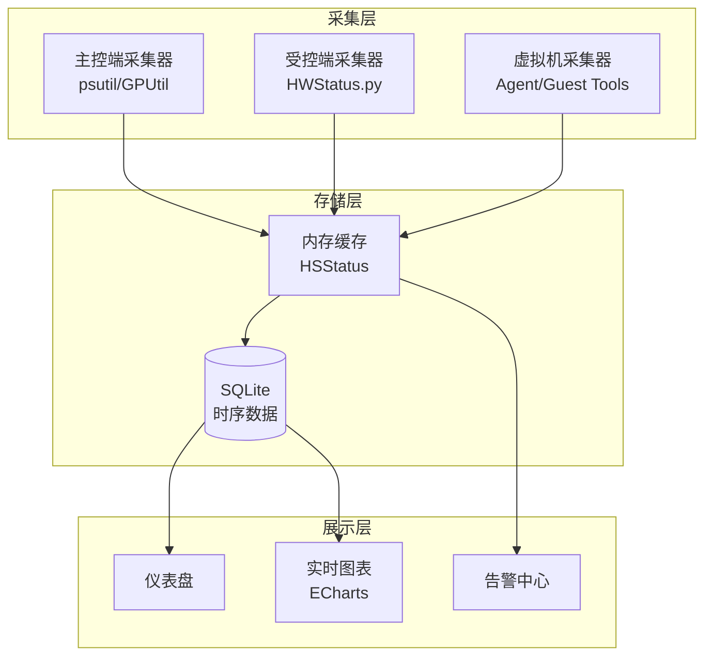
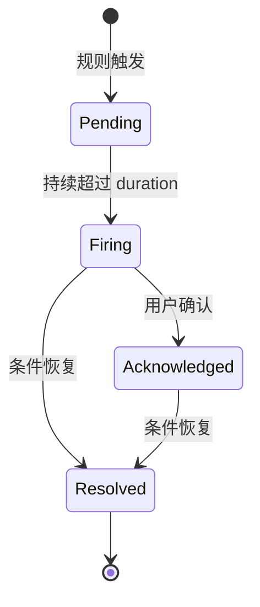

# 监控与告警

OpenIDCS 内置了完善的监控体系，覆盖主控端、受控主机、虚拟机三层，支持实时性能曲线、资源统计、阈值告警与异常通知。

## 监控体系



## 仪表盘概览

登录后的第一个页面即为 **总览仪表盘**，位于 `/dashboard`。

### 关键指标卡片

| 卡片 | 含义 | 取值范围 |
|------|------|----------|
| 主机总数 / 在线 | 受控主机数与当前可连接数 | 数值 |
| 虚拟机总数 / 运行中 | 所有平台 VM 总计与运行状态 | 数值 |
| CPU 总体使用率 | 加权平均 | 0-100% |
| 内存总体使用率 | 已用 / 总量 | 0-100% |
| 存储使用率 | 磁盘空间占用 | 0-100% |
| 网络吞吐 | 总入/出带宽 | MB/s |
| 今日操作数 | 24h 内用户操作计数 | 数值 |
| 未读告警 | 活跃未确认告警 | 数值 |

### 图表区域

- **资源趋势图**：过去 1h / 24h / 7d 的 CPU、内存、磁盘曲线
- **主机分布图**：按平台类型分组的饼图（VMware/LXC/Docker/PVE/...）
- **TOP5 高负载虚拟机**：按 CPU 排序
- **最近操作日志**：最近 10 条关键操作

## 主机监控

### 查看主机详情

进入 **主机管理** → 点击主机名进入详情页，包含以下监控面板：

#### 硬件信息

| 字段 | 说明 |
|------|------|
| CPU 型号 | 厂商、核心数、主频 |
| 内存 | 总量、类型、频率 |
| 磁盘 | 每块磁盘的容量与剩余 |
| 网卡 | MAC、IP、速率 |
| GPU | 显卡型号（如果有） |
| 系统 | 操作系统、内核版本 |

#### 实时性能

- **CPU 使用率曲线**：按核心、按进程
- **内存使用曲线**：Used / Cached / Buffer / Free
- **磁盘 I/O 曲线**：Read / Write IOPS 与 MB/s
- **网络流量曲线**：上行 / 下行 Mbps
- **系统负载**：1min / 5min / 15min load average

#### 采集频率

| 数据类型 | 默认周期 | 保留时长 |
|----------|----------|----------|
| 实时曲线 | 5s | 1h |
| 分钟粒度 | 1min | 24h |
| 小时粒度 | 1h | 30d |
| 每日汇总 | 1d | 1y |

可在 `settings.json` 中调整：

```json
{
  "monitoring": {
    "realtime_interval": 5,
    "minute_retention_hours": 24,
    "hour_retention_days": 30
  }
}
```

## 虚拟机监控

### 进入监控页

虚拟机详情页的 **监控** Tab 展示单台 VM 的详细指标。

### 支持的指标

| 指标 | VMware | LXC | Docker | PVE | HyperV | ESXi | Qingzhou |
|------|:------:|:---:|:------:|:---:|:------:|:----:|:--------:|
| 电源状态 | ✅ | ✅ | ✅ | ✅ | ✅ | ✅ | ✅ |
| CPU 使用率 | ✅ | ✅ | ✅ | ✅ | ✅ | ✅ | ✅ |
| 内存使用率 | ✅ | ✅ | ✅ | ✅ | ✅ | ✅ | ✅ |
| 磁盘 I/O | ✅ | ✅ | ✅ | ✅ | ⚠️ | ✅ | ⚠️ |
| 网络流量 | ✅ | ✅ | ✅ | ✅ | ✅ | ✅ | ✅ |
| 进程列表 | ❌ | ✅ | ✅ | ❌ | ❌ | ❌ | ❌ |
| Guest 内部指标 | ⚠️ | ✅ | ✅ | ⚠️ | ⚠️ | ⚠️ | ❌ |

::: tip
⚠️ 表示需要安装 Guest Agent 或 VMware Tools 才能获取。
:::

### 安装 Guest Agent（可选）

为获取更精细的虚拟机内部指标，可在 VM 内安装 Agent：

#### Linux

```bash
wget https://get.openidcs.org/agent/install.sh
sudo bash install.sh --server https://主控端:1880 --token YOUR_VM_TOKEN
sudo systemctl enable --now openidcs-agent
```

#### Windows

下载并运行 `openidcs-agent-setup.exe`，在安装向导中填入主控端地址与 VM Token。

## 告警规则

### 内置告警类型

| 告警类型 | 默认阈值 | 级别 |
|----------|----------|------|
| 主机离线 | 连续 3 次探活失败 | 🔴 Critical |
| 主机 CPU 过载 | > 90% 持续 5min | 🟠 Warning |
| 主机内存过载 | > 90% 持续 5min | 🟠 Warning |
| 磁盘空间告急 | 剩余 < 10% | 🟠 Warning |
| 磁盘空间耗尽 | 剩余 < 5% | 🔴 Critical |
| 虚拟机异常停止 | 非用户操作导致的关机 | 🟠 Warning |
| 虚拟机创建失败 | 任务失败 | 🟡 Info |
| 配额超限 | 用户资源接近 100% | 🟡 Info |
| 登录失败次数过多 | 5min 内 > 5 次 | 🟠 Warning |
| Token 即将过期 | 剩余 < 24h | 🟡 Info |

### 自定义告警规则

进入 **系统设置** → **告警规则** → **添加规则**：

```json
{
  "name": "核心业务 VM CPU 告警",
  "target_type": "vm",
  "target_filter": {
    "tags": ["production", "critical"]
  },
  "metric": "cpu.usage",
  "operator": ">",
  "threshold": 80,
  "duration_seconds": 300,
  "level": "warning",
  "cooldown_seconds": 1800,
  "notify_channels": ["email:ops", "webhook:slack"]
}
```

#### 可用字段

- `target_type`: `host` / `vm` / `user` / `system`
- `metric`: `cpu.usage` / `memory.usage` / `disk.usage` / `network.in` / `network.out` / `disk.io.read` / `disk.io.write`
- `operator`: `>` / `>=` / `<` / `<=` / `==`
- `level`: `info` / `warning` / `critical`
- `cooldown_seconds`: 触发后的静默时长，避免告警风暴

## 通知渠道

### 邮件通知

配置 SMTP：

```json
{
  "smtp": {
    "host": "smtp.example.com",
    "port": 465,
    "ssl": true,
    "user": "alert@example.com",
    "password": "YOUR_PASSWORD",
    "from": "OpenIDCS Alert <alert@example.com>"
  },
  "recipients": {
    "ops": ["ops1@example.com", "ops2@example.com"],
    "admin": ["admin@example.com"]
  }
}
```

### Webhook 通知

支持 POST JSON 到任意 URL，适配 Slack、钉钉、飞书、企业微信：

```json
{
  "webhooks": {
    "slack": {
      "url": "https://hooks.slack.com/services/XXX/YYY/ZZZ",
      "format": "slack"
    },
    "dingtalk": {
      "url": "https://oapi.dingtalk.com/robot/send?access_token=XXX",
      "format": "dingtalk",
      "secret": "SEC_XXX"
    },
    "feishu": {
      "url": "https://open.feishu.cn/open-apis/bot/v2/hook/XXX",
      "format": "feishu"
    },
    "wecom": {
      "url": "https://qyapi.weixin.qq.com/cgi-bin/webhook/send?key=XXX",
      "format": "wecom"
    }
  }
}
```

#### 载荷示例

```json
{
  "rule_id": 12,
  "rule_name": "核心业务 VM CPU 告警",
  "level": "warning",
  "target": {
    "type": "vm",
    "id": "vm-001",
    "name": "web-prod-01"
  },
  "metric": "cpu.usage",
  "value": 87.5,
  "threshold": 80,
  "triggered_at": "2026-04-24T12:20:00+08:00",
  "message": "VM web-prod-01 CPU 使用率 87.5% 持续超过 80% 阈值 5 分钟"
}
```

### 短信 / 电话（企业版对接）

通过 Webhook 对接阿里云、腾讯云短信服务或 PagerDuty。

## 告警中心

位于左侧菜单 **告警中心**，提供：

| 功能 | 说明 |
|------|------|
| 活跃告警 | 未确认的告警列表 |
| 历史告警 | 已确认或已恢复的告警 |
| 告警统计 | 按级别、类型、对象的聚合统计 |
| 告警静默 | 维护窗口期屏蔽指定告警 |
| 批量确认 | 一键确认多条告警 |

### 告警生命周期



## 资源报表

进入 **报表中心** 生成周期性资源报表：

- **日报 / 周报 / 月报**：CPU、内存、磁盘、网络峰值与均值
- **用户资源使用报表**：按用户聚合配额使用率
- **主机健康报表**：各主机可用性、告警次数
- **计费报表**（企业版）：按配额 * 使用时长计费

报表支持导出 PDF、Excel、CSV。

## 第三方集成

### Prometheus

OpenIDCS 暴露 Prometheus metrics 端点：

```
GET /api/metrics
```

配置 `prometheus.yml`：

```yaml
scrape_configs:
  - job_name: 'openidcs'
    bearer_token: 'YOUR_API_TOKEN'
    static_configs:
      - targets: ['openidcs.example.com:1880']
```

### Grafana

导入官方 Dashboard（ID: `openidcs-overview`），包含：
- 总体资源视图
- 各平台虚拟机数量变化
- TOP N 资源消耗者
- 告警趋势

## 常见问题

### 图表数据断点

**原因**：采集器异常或主机离线。

**排查**：
```bash
tail -n 100 DataSaving/log-monitor.log | grep ERROR
```

### CPU 使用率显示偏差

**原因**：Hyper-V 与青州云平台受限于 Hypervisor 暴露的指标粒度，可能为分钟级均值。

**说明**：建议在 VM 内部署 Agent 获取更精准数据。

### 告警不触发

**排查清单**：
1. 规则是否启用
2. `duration_seconds` 是否过长
3. `cooldown_seconds` 内是否已触发过
4. 通知渠道是否配置正确（可在 **告警规则** → **测试发送** 验证）

## 下一步

- 🔌 配置 [网络与端口转发](/tutorials/network)
- 💾 学习 [备份与快照](/tutorials/backup)
- 📝 查看 [日志管理](/tutorials/logs)
