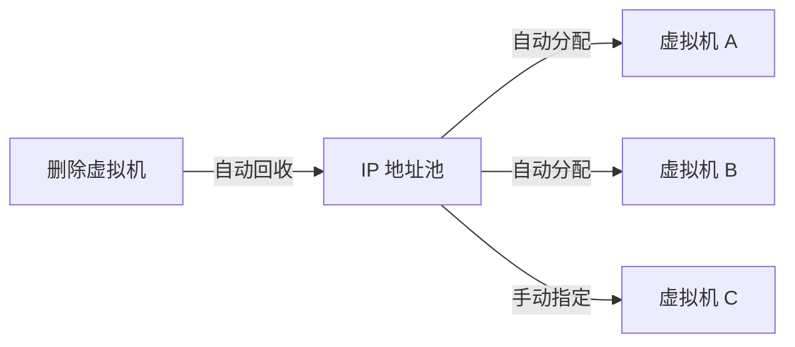

# 网络与端口转发

OpenIDCS 提供完整的虚拟网络管理能力：IP 地址池、NAT 端口转发、Web 反向代理、iptables 防火墙、SSH 隧道等一站式解决虚拟机对外发布服务的场景。

## 网络能力总览

| 能力 | 场景 | 说明 |
|------|------|------|
| **IP 地址池** | 自动分配 IPv4/IPv6 | 按主机或全局划分地址池，创建虚拟机时自动分配 |
| **NAT 端口转发** | 公网访问内网虚拟机 | iptables/nftables 转发，支持 TCP/UDP |
| **Web 反向代理** | 通过域名访问 Web 服务 | 内置 HTTP 反代，支持泛域名、自签 SSL |
| **iptables 防火墙** | 细粒度流量控制 | 按端口/协议/源地址放行或拒绝 |
| **带宽限速** | 公平分配带宽 | 基于 tc 限制上/下行 |
| **SSH 直连** | 终端化管理 | 主控端建立 SSH 隧道到内部虚拟机 |

---

## IP 地址池管理

### 工作原理



地址池支持：
- **公网池**：绑定到桥接网络（`docker-pub` / `br-pub` / `VMnet0`）
- **私网池**：绑定到 NAT 网络（`docker-nat` / `br-nat` / `VMnet8`）

### 新建 IP 池

1. 进入 **网络管理 → IP 地址池**
2. 点击 **新建池**，填写：
   - 池名称：`public-pool-1`
   - 类型：`公网 / 私网`
   - 起始地址：`114.193.206.1`
   - 结束地址：`114.193.206.254`
   - 掩码：`255.255.255.0`
   - 网关：`114.193.206.254`
   - DNS：`223.5.5.5, 8.8.8.8`
3. 保存后，该池即可在创建虚拟机时选择

### 保留地址

在池列表点击 **保留** 可将某些 IP 排除（例如给物理设备使用）：

```
114.193.206.1  - 交换机
114.193.206.2  - 路由器
114.193.206.254 - 网关
```

### 配额

可为每个用户设置 IP 配额（见 [权限管理](/tutorials/permissions)），避免 IP 被滥用。

---

## NAT 端口转发

### 场景

虚拟机使用内网 IP（`10.0.0.*`），需要将主机的公网端口映射到虚拟机，使外网可以访问虚拟机上的 Web、SSH、数据库等服务。

### 添加端口转发

1. 进入虚拟机详情 → **网络** 标签
2. 点击 **添加端口转发**
3. 填写：

| 字段 | 示例 | 说明 |
|------|------|------|
| 协议 | TCP | 可选 TCP / UDP |
| 主机端口 | 10022 | 公网访问的端口 |
| 虚拟机 IP | 10.0.0.5 | 内部 IP |
| 虚拟机端口 | 22 | 服务实际端口 |
| 备注 | SSH | 备注信息 |

4. 保存后，OpenIDCS 会自动在受控端执行：

```bash
iptables -t nat -A PREROUTING -p tcp --dport 10022 -j DNAT --to-destination 10.0.0.5:22
iptables -t nat -A POSTROUTING -p tcp -d 10.0.0.5 --dport 22 -j MASQUERADE
```

### 批量导入

支持 CSV 批量导入，格式：

```csv
protocol,host_port,vm_ip,vm_port,note
tcp,8080,10.0.0.5,80,Web
tcp,10022,10.0.0.5,22,SSH
udp,5353,10.0.0.6,53,DNS
```

### 常用端口速查

| 服务 | 端口 | 协议 |
|------|------|------|
| SSH | 22 | TCP |
| HTTP | 80 | TCP |
| HTTPS | 443 | TCP |
| RDP | 3389 | TCP |
| MySQL | 3306 | TCP |
| PostgreSQL | 5432 | TCP |
| Redis | 6379 | TCP |
| MongoDB | 27017 | TCP |

---

## Web 反向代理

### 适用场景

- 虚拟机内有 Web 服务，希望通过域名（而非 IP:端口）访问
- 多个虚拟机共用 80/443 端口
- 需要自动化签发 SSL 证书

### 配置步骤

1. 将域名解析到 **主控端** 的公网 IP（A 记录）
2. 进入 **网络管理 → Web 反向代理** → **新建代理**
3. 填写：

| 字段 | 示例 |
|------|------|
| 域名 | `app.example.com` |
| 目标地址 | `10.0.0.5` |
| 目标端口 | `80` |
| 协议 | `HTTP` |
| 启用 SSL | ✅ |
| 证书来源 | `自签 / 上传 / Let's Encrypt` |
| WebSocket | ✅ |

4. 保存后，OpenIDCS 自动更新内置反代规则

### 泛域名支持

可使用 `*.user1.example.com` 作为泛域名模板，为同一用户的所有虚拟机自动分配子域名。

### 自动续签 SSL

启用 Let's Encrypt 时，OpenIDCS 每天 02:00 自动检测 30 天内到期的证书并续签：

```bash
# 手动触发续签（主控端）
python HostServer.py --renew-ssl
```

---

## iptables 防火墙

### 防火墙策略

每台虚拟机可独立配置防火墙规则。OpenIDCS 在受控端生成对应的 `iptables` / `nftables` 规则链。

### 新建规则

进入 **虚拟机详情 → 防火墙** → **添加规则**：

| 字段 | 示例 | 说明 |
|------|------|------|
| 方向 | 入站 / 出站 | 流量方向 |
| 协议 | TCP / UDP / ICMP / ALL | |
| 源地址 | `192.168.1.0/24` 或 `any` | 支持 CIDR |
| 目标端口 | `22,80,443` | 支持多端口、范围 `8000-9000` |
| 动作 | 允许 / 拒绝 / 丢弃 | |
| 优先级 | 100 | 数字越小越靠前 |

### 常见策略模板

| 模板 | 规则 |
|------|------|
| **Web 服务器** | 允许 80、443；其余入站拒绝 |
| **数据库** | 仅允许主控端 IP 访问 3306 |
| **严格模式** | 仅允许 SSH，其余全部拒绝 |
| **开放模式** | 允许所有入站（仅用于测试） |

### 规则查看

在受控端可通过命令查看生效的规则：

```bash
# Docker 主机
iptables -t filter -L OPENIDCS-VM-<vmid> -n -v

# LXD 主机
nft list chain inet openidcs vm-<vmid>
```

---

## 带宽限速

### 配置限速

进入虚拟机编辑页 → **高级 → 带宽限制**：

| 字段 | 单位 | 说明 |
|------|------|------|
| 入站限速 | Mbps | 从外部到虚拟机 |
| 出站限速 | Mbps | 从虚拟机到外部 |
| 突发值 | KB | tc burst，默认自动 |

OpenIDCS 使用 `tc qdisc` 的 `htb` 实现：

```bash
# 出站限速 100 Mbps 的等效命令
tc qdisc add dev veth-<vmid> root handle 1: htb default 10
tc class add dev veth-<vmid> parent 1: classid 1:10 htb rate 100mbit
```

### 流量统计

在虚拟机详情 → **监控 → 网络流量**，可查看：
- 当前入站/出站速率
- 24 小时流量曲线
- 月度累计流量（用于配额）

---

## SSH 隧道直连

对于位于 NAT 内的虚拟机，OpenIDCS 支持通过主控端转发 SSH。

### 使用方式

1. 进入虚拟机详情 → 点击 **Web 终端**
2. 自动通过主控端连接到虚拟机的 22 端口
3. 无需单独配置端口转发

或使用本地 SSH 客户端：

```bash
# 通过主控端的 ProxyJump 直连
ssh -J openidcs@openidcs.example.com root@10.0.0.5
```

---

## 多网卡配置

部分平台（LXD / Proxmox / ESXi / VMware）支持为虚拟机配置多张网卡。

### 配置示例（LXD）

```yaml
devices:
  eth0:
    nictype: bridged
    parent: br-pub
    type: nic
  eth1:
    nictype: bridged
    parent: br-nat
    type: nic
```

### Web 界面操作

1. 虚拟机详情 → **网卡** 标签
2. 点击 **添加网卡**，选择网桥、指定 MAC（可自动生成）
3. 启动后进入虚拟机配置 IP 即可

---

## 故障排查

### 端口转发不生效

```bash
# 1. 查看转发规则
iptables -t nat -L PREROUTING -n --line-numbers

# 2. 检查内核转发是否开启
cat /proc/sys/net/ipv4/ip_forward  # 应为 1
sysctl -w net.ipv4.ip_forward=1

# 3. 检查 MASQUERADE
iptables -t nat -L POSTROUTING -n
```

### 反向代理 502

- 确认虚拟机服务已启动：`curl http://10.0.0.5:80`
- 检查安全组/防火墙是否允许主控端访问
- 查看主控端日志：`tail -f DataSaving/log-http-proxy.log`

### 虚拟机无法上网

```bash
# 虚拟机内
ping 网关IP     # 网关通？
ping 8.8.8.8   # 外网通？
cat /etc/resolv.conf  # DNS？
```

---

## 最佳实践

1. **分离公私网**：敏感服务放私网，仅通过端口转发暴露必要端口
2. **最小权限**：防火墙默认拒绝，按需开放
3. **记录规则**：端口转发/防火墙规则填写 **备注** 字段，便于后续维护
4. **定期清理**：虚拟机删除后，残留规则由 OpenIDCS 自动回收；若异常可在日志中核对

---

## 下一步

- 💾 查看 [备份与快照](/tutorials/backup)
- 📊 查看 [监控告警](/tutorials/monitoring)
- 👥 查看 [用户管理](/tutorials/user-management)
