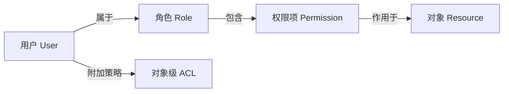
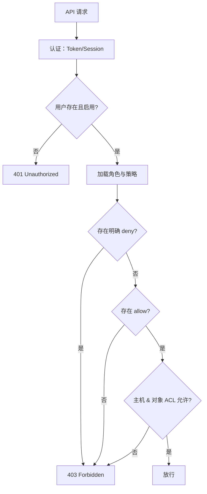

# 权限管理使用教程

OpenIDCS 使用 **RBAC（基于角色的访问控制）** 模型实现权限管理，同时支持**资源级**与**操作级**的细粒度控制。本教程介绍如何设计角色、分配权限、以及在 API 中校验权限。

## 权限模型



核心概念：

| 概念 | 说明 |
|------|------|
| Permission | 最小权限单元，如 `vm:create` |
| Role | 权限集合，如 `operator = {vm:*, net:read}` |
| Policy | 可在用户或角色上叠加的**附加策略** |
| ACL | 针对具体对象（某台虚拟机）的访问控制列表 |

## 权限项清单

权限命名规则：`<模块>:<动作>`，动作中 `*` 代表全部。

### 虚拟机模块（vm）

| 权限项 | 描述 |
|--------|------|
| `vm:create` | 创建虚拟机 |
| `vm:read` | 查看虚拟机信息 |
| `vm:update` | 修改配置（CPU/内存/磁盘/网卡）|
| `vm:delete` | 删除虚拟机 |
| `vm:power` | 电源操作（启停/重启/暂停）|
| `vm:console` | 控制台/终端访问 |
| `vm:snapshot` | 快照管理 |
| `vm:backup` | 备份与还原 |
| `vm:migrate` | 迁移到其他主机 |
| `vm:*` | 以上全部 |

### 主机模块（host）

| 权限项 | 描述 |
|--------|------|
| `host:read` | 查看主机列表与监控 |
| `host:create` | 添加受控端主机 |
| `host:update` | 修改主机参数 |
| `host:delete` | 移除主机 |
| `host:manage` | 维护模式、重启主机代理 |

### 网络模块（net）

| 权限项 | 描述 |
|--------|------|
| `net:read` | 查看 IP 池、端口转发、反代规则 |
| `net:nat` | 配置 NAT 端口转发 |
| `net:proxy` | 配置 Web 反向代理 |
| `net:firewall` | 配置防火墙规则 |
| `net:ippool` | 管理 IP 地址池 |

### 用户与权限模块（user / rbac）

| 权限项 | 描述 |
|--------|------|
| `user:read` | 查看用户列表 |
| `user:create` | 创建用户 |
| `user:update` | 修改账户信息、配额 |
| `user:delete` | 删除账户 |
| `rbac:manage` | 管理角色、权限、策略 |

### 系统模块（sys）

| 权限项 | 描述 |
|--------|------|
| `sys:config` | 修改系统全局配置 |
| `sys:log` | 查看日志 |
| `sys:audit` | 查看审计日志 |
| `sys:backup` | 系统级备份 |

## 内置角色

| 角色 | 权限集 | 适用对象 |
|------|--------|----------|
| `admin` | `*:*`（所有权限）| 系统管理员 |
| `operator` | `vm:*`, `host:read`, `net:read`, `net:nat`, `net:proxy` | 运维人员 |
| `user` | `vm:create`, `vm:read`, `vm:update`, `vm:delete`, `vm:power`, `vm:console`, `vm:snapshot`, `vm:backup` | 普通租户 |
| `readonly` | `vm:read`, `host:read`, `net:read`, `sys:log` | 审计/查看者 |
| `guest` | `vm:read`（仅自己的）| 临时访客 |

::: tip 提示
内置角色不可删除，但可被覆盖：系统优先使用同名自定义角色。
:::

## 自定义角色

### 创建角色

1. 进入 **权限管理 → 角色 → 创建角色**。
2. 填写角色标识（如 `backup-operator`）和描述。
3. 在权限树中勾选需要的权限项：
   ```
   ✅ vm:read
   ✅ vm:backup
   ✅ vm:snapshot
   ✅ sys:log
   ```
4. 点击 **保存**。

### 复制角色

若想在已有角色基础上微调：

1. 进入现有角色详情 → **复制为新角色**。
2. 修改角色名 → 增删权限 → 保存。

### 分配角色

在 **用户管理 → 用户详情 → 角色** 中：

- **主角色**：单选，决定默认权限
- **附加角色**：多选，权限取并集

### 通过 API 管理角色

```bash
# 创建角色
POST /api/rbac/role
{
  "name": "backup-operator",
  "desc": "只负责备份的操作员",
  "permissions": ["vm:read", "vm:backup", "vm:snapshot", "sys:log"]
}

# 给用户分配角色
POST /api/user/alice/roles
{ "roles": ["user", "backup-operator"] }
```

## 对象级 ACL

除了角色级权限，OpenIDCS 还支持对具体实例授权：

1. 在虚拟机详情页 → **共享与授权**。
2. 添加协作者并指定权限：
   ```
   bob   → 只读（read）
   carol → 电源操作（power + read）
   dave  → 完全控制（除删除外的全部操作）
   ```
3. 被授权者即可在自己的实例列表中看到共享的实例。

::: warning 注意
对象级 ACL 只能**收紧**而非放宽：若用户角色中没有 `vm:read`，即便在某台虚拟机上被授予 `read`，也无法看到该实例。
:::

## 权限策略（Policy）

对于更复杂的条件，可使用策略表达式：

```yaml
# 策略示例：只允许在工作时间操作生产环境虚拟机
name: production-hours
effect: allow
actions: ["vm:power", "vm:update"]
resources: ["vm:prod-*"]
conditions:
  time:
    weekday: [1,2,3,4,5]
    hour: [9, 18]
  ip:
    cidr: ["10.0.0.0/8"]
```

字段说明：

| 字段 | 说明 |
|------|------|
| `effect` | `allow` 或 `deny` |
| `actions` | 权限项列表，支持通配符 |
| `resources` | 资源匹配，支持前缀/正则 |
| `conditions` | 可选条件：时间、IP、MFA 状态等 |

::: tip 优先级
`deny` 优先级高于 `allow`：当多条策略结果冲突时，只要存在一条 `deny` 就拒绝。
:::

## 主机授权

在 **用户管理 → 主机授权** 中为用户勾选可用主机。这是一种粗粒度的物理隔离：

- 勾选 `docker-01` → 用户只能在 `docker-01` 上创建/查看/操作实例
- 留空 → 使用系统默认（全部允许或全部禁止，由全局开关决定）

## 权限校验流程



## 常见场景示例

### 场景 1：创建只读审计账号

```
角色: auditor
权限: vm:read, host:read, net:read, sys:log, sys:audit
主机授权: 全部勾选
配额: 0（无需创建资源）
```

### 场景 2：运维工程师，但禁止删除

```
基础角色: operator
附加 deny 策略:
  actions: ["vm:delete", "host:delete"]
  resources: ["*"]
```

### 场景 3：研发部独立租户

```
角色: user
主机授权: dev-lxd-01, dev-docker-01
配额: 20 vCPU / 40 GB 内存 / 1 TB 磁盘 / 20 实例
```

## 常见问题

### 为什么修改权限后没立即生效？

Token 的权限在**签发时快照**。为确保立即生效，有两种做法：

1. 吊销用户现有 Token，强制其重新登录。
2. 等待 Token 自然过期（默认 24 小时）。

也可以在 **系统配置** 中开启 **"权限变更立即广播"** 选项，后台会主动通知前端刷新。

### 管理员误删角色怎么办？

- 内置角色删不掉，不必担心。
- 自定义角色进入**回收站**，7 天内可恢复；7 天后彻底清除。
- 若是手动清库，需要通过数据库备份（参见 [主控端配置 → 备份](/config/server)）恢复。

### 用户无法访问控制台但能看到虚拟机

检查该用户/角色是否缺少 `vm:console` 权限。控制台与查看是两个独立权限项。

## 相关链接

- [用户管理](/tutorials/user-management)
- [虚拟机管理](/tutorials/vm-management)
- [日志与审计](/tutorials/logs)
