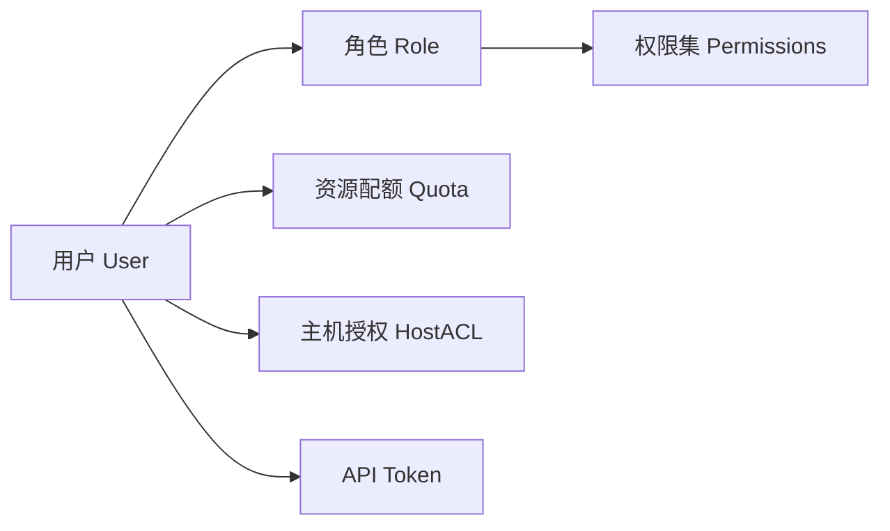

# 用户管理使用教程

OpenIDCS 内置多租户用户体系，支持账户注册/登录、资源配额、API Token、会话控制与基础的审计能力。本教程说明如何在 **用户管理** 菜单中完成日常账户运营。

## 用户体系概览



| 概念 | 说明 |
|------|------|
| 用户 | 独立登录账户，拥有唯一用户名 |
| 角色 | `admin` / `operator` / `user` / `readonly` 等，角色决定默认权限集 |
| 配额 | 限制 CPU、内存、磁盘、实例数量、网络流量等资源使用 |
| 主机授权 | 限定用户只能在指定的受控端主机上创建虚拟机 |
| API Token | 无需账号密码即可调用 REST API，可单独吊销 |

## 创建用户

1. 进入 **用户管理 → 用户列表 → 创建用户**。
2. 填写表单：

    | 字段 | 要求 |
    |------|------|
    | 用户名 | 3~32 位字母数字下划线，全局唯一 |
    | 密码 | ≥ 8 位，包含大小写字母和数字，建议含特殊字符 |
    | 邮箱 | 用于找回密码与告警通知 |
    | 角色 | 选择预设角色，可在 [权限管理](/tutorials/permissions) 中自定义 |
    | 状态 | 启用 / 禁用 |
    | 到期时间 | 可选，到期后账户自动禁用 |

3. 在 **配额** 子标签设置资源上限：

    ```
    CPU       : 8 vCPU
    内存      : 16384 MB
    磁盘      : 500 GB
    实例数量  : 10
    快照数量  : 20
    月流量    : 500 GB
    ```

4. 在 **主机授权** 中勾选允许该用户使用的受控端主机。
5. 点击 **创建**，系统会向用户邮箱发送激活邮件（如启用邮件服务）。

### 通过 API 创建

```bash
curl -X POST http://localhost:1880/api/user/create \
  -H "Authorization: Bearer <AdminToken>" \
  -H "Content-Type: application/json" \
  -d '{
    "username": "alice",
    "password": "Str0ng@Pass",
    "email": "alice@example.com",
    "role": "operator",
    "quota": { "vcpu": 8, "memory": 16384, "disk": 500, "vms": 10 },
    "hosts": ["docker-01", "lxd-01"]
  }'
```

## 登录与会话

### 登录方式

| 方式 | 说明 |
|------|------|
| 用户名 + 密码 | 标准 Web 登录 |
| 首启 Token | 首次部署时控制台打印的临时 Token |
| API Token | 在 **个人中心 → Token** 中生成，调用 API 时放入 `Authorization: Bearer xxx` |
| SSO（规划中） | 支持 OIDC / LDAP 对接 |

### 会话策略

系统默认策略（可在 [主控端配置](/config/server) 的 `.env` 中修改）：

- **会话超时**：3600 秒（无操作自动登出）
- **登录失败锁定**：连续 5 次失败锁定 30 分钟
- **密码有效期**：默认不强制过期，可配置 90/180 天
- **Cookie 属性**：生产环境建议启用 `Secure` 与 `HttpOnly`

### 踢人下线

管理员进入 **用户管理 → 在线用户**，可看到当前活跃会话，支持：

- 查看登录 IP、User-Agent、登录时间
- 强制下线（吊销该会话 Token）
- 禁用账户（所有会话立即失效）

## 修改与禁用

| 操作 | 入口 | 说明 |
|------|------|------|
| 修改密码 | 用户详情 → **重置密码** | 管理员可直接重置；用户可在「个人中心」自行修改 |
| 修改角色 | 用户详情 → **角色** | 修改后立即生效 |
| 调整配额 | 用户详情 → **配额** | 减少配额时不会自动回收已用资源，仅限制后续申请 |
| 禁用账户 | 用户详情 → **状态** | 禁用后无法登录，已有虚拟机保留但无法操作 |
| 删除账户 | 用户详情 → **删除** | 需先回收其名下的所有实例；支持 30 天保留 |

## 配额管理

### 配额项

| 配额项 | 单位 | 统计口径 |
|--------|------|----------|
| vCPU | 核 | 所有运行中实例 vCPU 求和 |
| 内存 | MB | 所有运行中实例内存求和 |
| 磁盘 | GB | 所有实例（含关机）磁盘总和 |
| 实例数 | 个 | 包含关机但不含回收站中的实例 |
| 快照数 | 个 | 名下所有实例的快照总数 |
| 月流量 | GB | 每月 1 日 00:00 自动清零 |

### 配额告警

在 **用户管理 → 配额告警** 中可为用户开启：

- **80% 预警**：发送邮件与站内信
- **100% 阻断**：阻止继续创建新实例
- **超额续费**：可对接计费接口自动扣款（需自行实现 Webhook）

## API Token 管理

1. 进入 **个人中心 → API Token → 创建 Token**。
2. 设置：
   - **名称**：用于区分用途（如 `ci-deploy`）
   - **有效期**：永久 / 30 天 / 90 天 / 自定义
   - **权限范围**：可选择复用用户权限，或缩小到 **只读** 等子集
   - **IP 白名单**：限定该 Token 只能从特定 IP 调用
3. 创建成功后**仅显示一次**，请立即复制保存。
4. 若泄漏可在列表中点击 **吊销**，被吊销的 Token 立即失效。

::: tip 最佳实践
- 为 CI/CD、监控、备份脚本分别创建独立 Token，便于审计与回收。
- 切勿将 Token 提交到代码仓库；使用环境变量或 Secret 管理工具。
:::

## 多租户隔离

OpenIDCS 采用**软隔离**模型：

- **资源隔离**：不同用户看不到彼此的实例、IP、备份
- **数据隔离**：数据库中以 `owner` 字段区分归属
- **操作隔离**：普通用户无法访问其他用户的 API 对象
- **主机隔离**：通过「主机授权」进一步限定可用主机范围

::: warning 注意
软隔离假设底层受控端是可信的。若需要**硬多租户**（完全独立的受控端集群），建议为每个租户分配独立的物理/虚拟主机，再通过主机授权绑定。
:::

## 审计与日志

所有敏感操作都会写入审计日志：

- 登录成功/失败
- 创建/删除用户
- 修改密码、重置 Token
- 修改权限、配额

查询入口：**日志管理 → 审计日志**，支持按用户名、操作类型、时间范围过滤。详见 [日志管理](/tutorials/logs)。

## 常见问题

### 用户忘记密码

1. 管理员在 **用户列表** 点击 **重置密码**，生成临时密码发送到用户邮箱。
2. 若邮箱不可用，可直接在界面上设置新密码并告知用户。
3. 用户登录后应立即在「个人中心」修改为自己的密码。

### 删除用户但其虚拟机还在运行

- 系统会阻止直接删除仍有实例的账户。
- 请先将实例转让给其他用户（**批量操作 → 转让 Owner**），或统一删除。

### API Token 明明未过期却 401

常见原因：

1. Token 被管理员吊销或用户被禁用
2. 请求来源 IP 不在 Token 的白名单内
3. 请求头格式错误，正确写法：`Authorization: Bearer <token>`
4. 服务器时间不同步（TOTP 相关接口会失败）

## 相关链接

- [权限管理](/tutorials/permissions)
- [虚拟机管理](/tutorials/vm-management)
- [日志与审计](/tutorials/logs)
- [主控端配置](/config/server)
