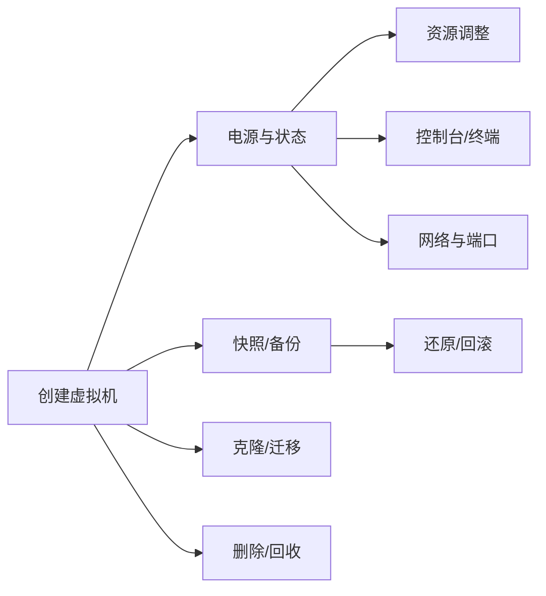

# 虚拟机管理使用教程

虚拟机管理是 OpenIDCS 的核心功能。本教程将全面介绍如何在 Web 控制台中完成虚拟机的**创建、运行、调整、备份、迁移与回收**等全生命周期操作，并说明 REST API 的对应调用方式。

::: tip 适用范围
本教程对所有受支持的虚拟化平台（VMware Workstation / vSphere ESXi / LXC/LXD / Docker/Podman / Proxmox VE / Windows Hyper-V / 青州云）均适用，差异之处会在文中明确标注。
:::

## 功能总览



| 能力 | 说明 | 涉及菜单 |
|------|------|----------|
| 创建 | 基于模板/ISO/镜像创建实例 | 虚拟机管理 → 创建虚拟机 |
| 生命周期 | 启动 / 停止 / 重启 / 暂停 / 强制关机 | 实例详情页 |
| 配置调整 | CPU / 内存 / 磁盘 / 网卡 | 实例详情页 → 配置 |
| 控制台 | VNC / SSH / Web Terminal | 实例详情页 → 控制台 |
| 快照 | 创建 / 回滚 / 删除 | 实例详情页 → 快照 |
| 备份 | 完整备份 / 差异备份 / 还原 | 实例详情页 → 备份 |
| 克隆 | 完整克隆 / 链接克隆 | 实例详情页 → 克隆 |
| 迁移 | 跨主机 / 跨平台 | 实例详情页 → 迁移 |
| 批量操作 | 批量启动 / 停止 / 删除 | 虚拟机列表页 |

## 创建虚拟机

### Web 界面创建

1. 登录 OpenIDCS，进入 **虚拟机管理 → 创建虚拟机**。
2. 按向导填写：

    | 分类 | 字段 | 说明 |
    |------|------|------|
    | 基本 | 名称 | 仅允许字母、数字、下划线、中划线，需全局唯一 |
    | 基本 | 所属主机 | 选择已添加的受控端主机 |
    | 基本 | 操作系统 | 选择镜像或模板；容器平台选择镜像标签 |
    | 资源 | vCPU | 整数，需 ≤ 用户配额 |
    | 资源 | 内存 (MB) | 需 ≤ 用户配额；部分平台要求 2 的幂次 |
    | 资源 | 磁盘 (GB) | 系统盘容量；可追加数据盘 |
    | 网络 | 网桥 | 从主机的公网/内网网桥中选择 |
    | 网络 | IP 分配 | 自动分配（从 IP 池）或手动指定 |
    | 网络 | MAC 地址 | 留空自动生成 |
    | 认证 | 初始密码 | 首次启动后可通过改密功能修改 |

3. 点击 **确认创建**，进入列表页查看进度。

### 通过 REST API 创建

```bash
curl -X POST http://localhost:1880/api/vm/create \
  -H "Content-Type: application/json" \
  -H "Authorization: Bearer <Token>" \
  -d '{
    "host_name": "docker-01",
    "vm_name": "web-01",
    "os_template": "ubuntu:22.04",
    "vcpu": 2,
    "memory": 2048,
    "disk": 20,
    "network": {
      "bridge": "docker-nat",
      "ip": "auto"
    },
    "password": "Strong@Pass123"
  }'
```

返回示例：

```json
{
  "code": 0,
  "msg": "ok",
  "data": { "task_id": "T-20260424-0001", "vm_id": "web-01" }
}
```

### 批量创建（模板克隆）

在 **虚拟机管理 → 批量创建** 页面中：

1. 选择已有虚拟机或模板作为源。
2. 指定数量（例如 `5`）与命名规则（如 `web-{n}`）。
3. 设置 IP 起始地址，系统自动递增分配。
4. 启动任务后可在 **任务中心** 查看进度。

## 电源与状态管理

| 操作 | 说明 | 适用场景 |
|------|------|----------|
| 启动 | 正常开机 | 日常开机 |
| 关机 | 发送 ACPI 关机信号，系统优雅退出 | 推荐的关机方式 |
| 强制关机 | 立即断电，可能导致数据丢失 | 系统卡死时使用 |
| 重启 | 软重启 | 应用配置后生效 |
| 暂停 | 将运行状态挂起到磁盘 | 短时间释放 CPU |
| 恢复 | 从暂停状态继续运行 | 配合暂停使用 |

::: warning 平台差异
- LXC/LXD、Docker/Podman 不支持「暂停/恢复」，会退化为停止/启动。
- Hyper-V 的 **SaveState** 等同于暂停。
- 青州云由云厂商接口控制，部分操作有 10～30 秒异步延迟。
:::

### 批量电源操作

在虚拟机列表页勾选多台实例，点击顶部 **批量操作 → 启动/停止/重启**，系统会提交一个异步任务，可在任务中心追踪每台实例的执行结果。

## 资源调整

### 在线调整（支持热插拔的平台）

| 平台 | CPU | 内存 | 磁盘 | 网卡 |
|------|-----|------|------|------|
| VMware Workstation | ❌ 需关机 | ❌ 需关机 | ✅ | ✅ |
| vSphere ESXi | ✅（需开启 CPU Hot-Add）| ✅ | ✅ | ✅ |
| Proxmox VE | ✅ | ✅（气球驱动）| ✅ | ✅ |
| Hyper-V | ❌ 需关机（动态内存除外）| ✅（动态内存）| ✅ | ✅ |
| LXC/LXD | ✅ | ✅ | ✅ | ✅ |
| Docker/Podman | ❌ 需重建 | ❌ 需重建 | ⚠️ 仅限卷 | ❌ |

### 磁盘操作

- **扩容**：详情页 → **磁盘** → 选择磁盘 → **扩容**，输入新容量。扩容完成后需在客户机内执行 `growpart` + `resize2fs`/`xfs_growfs`。
- **挂载 ISO**：详情页 → **光驱** → **挂载 ISO**，选择镜像库中的 ISO。
- **添加数据盘**：详情页 → **磁盘** → **添加磁盘**，可选择精简/厚置备。
- **磁盘迁移**：VMware/Proxmox 支持将磁盘从一个数据存储迁移到另一个，不中断运行。

## 控制台访问

### Web VNC

1. 进入实例详情页，点击 **控制台** 页签。
2. 系统自动建立 Websockify 通道，浏览器内即可操作图形界面。
3. 支持 **全屏**、**发送 Ctrl+Alt+Del**、**剪贴板同步** 等。

### SSH / Web Terminal

- **SSH 直连**：实例详情页 → **终端**，后端通过 `SSHDManager` 建立连接，全程由主控端代理，无需暴露虚拟机 SSH 端口到公网。
- **Web Terminal (ttyd)**：容器类受控端可安装 ttyd，在「容器终端」页签中使用，无需 SSH Key。

### RDP（Windows 虚拟机）

1. 在 **网络 → 端口转发** 中将宿主机端口（如 `13389`）映射到虚拟机 `3389`。
2. 使用 `mstsc` / Remmina 连接 `宿主机IP:13389`。

## 快照与备份

### 快照

快照保存某一时刻的磁盘+内存状态，适合**临时回滚点**。

```bash
# 创建快照
POST /api/vm/{vm_id}/snapshot
{ "name": "before-upgrade", "desc": "升级前" }

# 回滚
POST /api/vm/{vm_id}/snapshot/{snap_id}/restore

# 删除
DELETE /api/vm/{vm_id}/snapshot/{snap_id}
```

::: warning 注意
- 保留大量快照会增加磁盘开销与 I/O 损耗，建议单机不超过 5 个快照。
- 容器类（Docker/LXC）一般不支持内存快照，仅支持磁盘快照。
:::

### 备份

备份会把实例导出为独立文件，可跨主机还原。

| 类型 | 特点 | 建议频率 |
|------|------|----------|
| 完整备份 | 导出完整磁盘 + 配置 | 每周一次 |
| 差异备份 | 仅备份变化块 | 每日一次 |
| 外部备份 | 备份到 NFS/S3/远端存储 | 灾备场景 |

操作步骤：

1. 详情页 → **备份** → **创建备份**。
2. 选择备份类型和目标存储位置（主机本地 / NFS / S3）。
3. 在 **备份列表** 中查看、还原、删除历史备份。

## 克隆与迁移

### 克隆

- **完整克隆**：生成完全独立的副本，源不影响副本。
- **链接克隆**：基于快照共享基础磁盘，占用空间小，但依赖源盘。

### 迁移

| 迁移类型 | 支持平台 | 停机时间 |
|----------|----------|----------|
| 冷迁移（停机） | 所有平台 | 分钟级 |
| 热迁移（vMotion/Live） | ESXi / Proxmox / LXD | 秒级 |
| 跨平台迁移 | 通过备份还原实现 | 分钟级 |

## 删除与回收

1. 详情页 → **删除实例**，勾选：
   - ☑ 删除磁盘文件
   - ☑ 释放 IP 地址
   - ☑ 删除关联快照/备份
2. 进入 **回收站**（默认保留 7 天）可撤回误删。
3. 超过保留期后数据会被彻底清除。

## 常见问题

### 创建时提示"超出配额"

进入 **用户管理 → 配额**，检查当前用户的 CPU/内存/磁盘/数量使用率。需要调高时由管理员修改。参见 [用户管理](/tutorials/user-management) 与 [权限管理](/tutorials/permissions)。

### 启动后一直"启动中"

1. 查看 **任务中心** 对应任务的错误信息。
2. 查看 **日志管理** 中 `vm.log`，过滤 `vm_id`。详见 [日志管理](/tutorials/logs)。
3. 到受控端主机执行原生命令（`docker ps`、`lxc list`、`vmrun list` 等）对照状态。

### VNC 控制台黑屏

- 确认虚拟机已真正进入操作系统（冷启动可能需要 30 秒）。
- 若平台为 LXC/Docker，无图形界面，应改用 **终端** 页签。
- 检查 Websockify 服务是否正常（主控端日志 `log-ws.log`）。

## 相关链接

- [功能概览](/guide/features)
- [用户管理](/tutorials/user-management)
- [权限管理](/tutorials/permissions)
- [网络与端口](/tutorials/network)
- [备份与恢复](/tutorials/backup)
- [日志与审计](/tutorials/logs)
