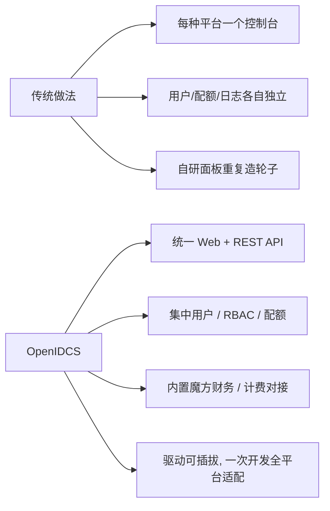

# 核心优势

OpenIDCS 不是又一个"虚拟机管理工具"，而是一个聚焦于**多虚拟化统一纳管 + 多租户对外交付**的开源平台。以下是它相比商业方案和其他开源项目的核心差异。

## 一图看懂 OpenIDCS 的定位

## 1. 真正的"多虚拟化"统一管理

市面上大多数"虚拟化管理平台"只支持 **一种后端**（纯 KVM、纯 ESXi、纯容器）。OpenIDCS 通过驱动层抽象，**在同一个列表里同时管理**：

- Docker / Podman 容器
- LXC / LXD 系统容器
- VMware Workstation / ESXi
- Proxmox VE / QEMU
- Windows Hyper-V
- 青州云

对运维来说，无论底层是哪种平台，**开机、关机、改密、快照、备份、挂盘、改配**都是同一个按钮。

## 2. 面向"对外交付"的多租户体系

OpenIDCS 从第一天就按照 **"对外给终端客户开通 VPS / 云主机"** 的场景设计：

| 能力 | 说明 |
|------|------|
| **多用户 + RBAC** | 管理员 / 普通用户 / 只读用户三级角色，可自定义细粒度权限 |
| **资源配额** | 按用户限制 CPU / 内存 / 存储 / 虚拟机数 / 带宽 |
| **魔方财务对接** | 原生支持 SwapIDC / IDCSmart，开箱分销 |
| **操作审计** | 所有 Web / API 操作均有日志，支持追溯 |
| **Token + Session 双认证** | 同时满足 Web 登录与自动化调用 |

这一套组合在商业方案里往往要**单独付费**。

## 3. 轻量但完整：不依赖复杂组件

| 对比项 | 商业面板 / 大型开源云 | **OpenIDCS** |
|--------|----------------------|--------------|
| 部署步骤 | 需要数据库、消息队列、Redis、K8s 等 | 单进程 + SQLite，一条命令启动 |
| 运行内存 | 8GB 起步 | 2~4GB 即可跑满功能 |
| 学习成本 | 需要培训 | 前端直觉化，新手 10 分钟上手 |
| 资源占用 | 管理平台本身占用大量算力 | 管理平台开销接近忽略 |

对于 **中小 IDC / 私有化项目 / 教学实验室**，OpenIDCS 的"轻"是非常大的优势。

## 4. 现代化前端体验

- React 18 + TypeScript + Vite，秒级热更新
- Ant Design 5 + TailwindCSS，支持**暗黑 / 白天 / 透明**三种主题
- ECharts 图表，实时曲线平滑不卡顿
- 原生支持**中英文国际化**
- Web VNC / Web SSH / Web Terminal，全部**浏览器即可访问**，无需客户端

## 5. 完整的 RESTful API + SDK

**每一个 Web 能做的操作，都有对应的 HTTP 接口**：

- `POST /api/vms` 创建虚拟机
- `POST /api/vms/{id}/power` 开关机
- `POST /api/vms/{id}/snapshot` 快照
- `POST /api/users` 创建用户、配额
- `GET  /api/monitor/host/{name}` 主机性能

这意味着你可以：

- 用 Python / Go / Shell 直接调用
- 集成到自己的运维平台
- 做自动化巡检、压测、CMDB 同步
- 对接任意计费 / 审批 / 工单系统

完整文档见 [APIDOC_ALL.md](https://github.com/OpenIDCSTeam/OpenIDCS-Client/blob/main/ProjectDoc/APIDOC_ALL.md)。

## 6. 基于 AGPLv3 的彻底开源

- 所有前后端代码公开在 GitHub
- 允许商业使用、二次开发、集成到自己的产品
- 修改后的代码必须开源（对社区友好）
- 不存在"社区版功能阉割 + 企业版收费"的双版本策略

## 7. 细节处的工程质量

- **驱动插件化**：新增一个虚拟化平台只需实现 `BasicServer` 接口，不影响其他平台
- **冷热分离**：主控端停机不影响受控端虚拟机正常运行
- **增量备份**：支持压缩 + 增量 + 异地，节省存储成本
- **IP 池智能分配**：公网 / NAT 双池，自动回收
- **NAT + Web 反代**：同一个物理 IP 对外暴露上百台虚拟机的多个端口与域名

## 与典型方案对比

| 对比维度 | 纯 vCenter | 纯 Proxmox | OpenStack | **OpenIDCS** |
|----------|------------|------------|-----------|--------------|
| 多虚拟化后端 | ❌ 仅 VMware | ❌ 仅 KVM/LXC | ⚠️ 需要插件 | ✅ 7 种开箱即用 |
| 容器 + 虚拟机混合 | ❌ | ⚠️ | ⚠️ | ✅ |
| 对外多租户 / 计费 | ❌ 另购 | ⚠️ 第三方 | ⚠️ 复杂 | ✅ 内置 + 魔方对接 |
| 部署复杂度 | ⚠️ 中 | ✅ 低 | ❌ 高 | ✅ 极低 |
| 开源 | ❌ 商业 | ✅ AGPLv3 | ✅ Apache | ✅ AGPLv3 |
| API 完整度 | ✅ | ⚠️ | ✅ | ✅ |
| 硬件要求 | 高 | 中 | 极高 | **低** |

## 不适合的场景

为了让读者做出理性选择，我们也说明 **OpenIDCS 目前还不太适合的场景**：

- **超大规模公有云**（万台+ 节点）：建议选择 OpenStack / CloudStack
- **对 HA / FT 有极高要求的核心交易系统**：建议使用原生 vSphere HA
- **纯 Kubernetes 生态**：建议直接使用 K8s + Rancher

对于 **中小 IDC、私有化项目、教学、研发测试、多虚拟化混用** 场景，OpenIDCS 是目前最平衡的开源选择。

## 下一步

- 📖 查看 [功能概览](/guide/features) 获取完整功能清单
- 🏗️ 查看 [架构设计](/guide/architecture) 了解内部实现
- 🚀 查看 [快速上手](/guide/quick-start) 立刻部署试用
