# 功能概览

OpenIDCS 围绕"**多虚拟化统一管理 + 多租户对外交付**"两条主线，提供一整套覆盖 **虚拟机生命周期、网络、用户、监控、日志、备份、API** 的完整能力。本页提供清晰的**功能矩阵**，方便你快速定位所需能力。

## 功能全景图

```mermaid
mindmap
  root((OpenIDCS 能力))
    虚拟机
      生命周期
      改配/改密
      快照/备份
      磁盘/ISO 挂载
      PCI/USB 直通
    网络
      IP 池管理
      NAT 端口转发
      Web 反向代理
      iptables 防火墙
    用户
      多租户
      RBAC 角色
      配额限制
      Token/Session
    监控
      主机性能
      虚拟机性能
      实时图表
      告警
    日志
      操作/系统/安全
      搜索/导出
    远程
      Web VNC
      Web SSH
    API
      RESTful
      魔方对接
```

## 1. 多虚拟化平台支持

OpenIDCS 通过驱动抽象层，支持 **7 种主流虚拟化平台**，均已生产就绪：

| 平台 | 类型 | 典型端口 | 状态 |
|------|------|----------|------|
| Docker / Podman / K8SC | 容器 | 2376 | ✅ |
| LXC / LXD | 系统容器 | 8443 | ✅ |
| VMware Workstation | 桌面虚拟化 | 8697 | ✅ |
| VMware vSphere ESXi | 企业级虚拟化 | 443 | ✅ |
| Proxmox VE / QEMU | 开源虚拟化 | 8006 | ✅ |
| Windows Hyper-V | 企业桌面 / Server | 5985 (WinRM) | ✅ |
| 青州云 Qingzhou | 私有云 API | OpenAPI | ✅ |

每个平台的详细优缺点、安装配置、使用限制请见 [虚拟化平台](/vm/comparison) 章节。

## 2. 虚拟机生命周期管理

### 2.1 能力矩阵

> ✅ 完整支持  ⚠️ 部分支持  ❌ 平台限制  — 不适用

| 能力 | VMware | ESXi | Workstation 之外 | LXC/LXD | Docker/OCI | Proxmox | Hyper-V | 青州云 |
|------|:-----:|:----:|:----------------:|:-------:|:----------:|:-------:|:-------:|:------:|
| 创建 / 删除 | ✅ | ✅ | - | ✅ | ✅ | ✅ | ✅ | ✅ |
| 开机 / 关机 / 重启 | ✅ | ✅ | - | ✅ | ✅ | ✅ | ✅ | ✅ |
| 暂停 / 恢复 | ✅ | ✅ | - | ⚠️ | ✅ | ✅ | ✅ | ⚠️ |
| 改密 `VMPasswd` | ✅ | ✅ | - | ✅外部 | ✅外部 | ✅ | ✅ | ✅ |
| 截图 `VMScreen` | ✅ | ✅ | - | ❌ | ❌ | ✅ | ✅ | ✅ |
| 改配（CPU/RAM） | ✅ | ✅ | - | ✅ | ✅ | ✅ | ✅ | ✅ |
| 快照（snapshot） | ✅ | ✅ | - | ✅ | ⚠️ | ✅ | ✅ | ✅ |
| 备份 `VMBackup` | ✅ | ✅ | - | ✅ | ✅ | ✅ | ✅ | ✅ |
| 还原 `Restores` | ✅ | ✅ | - | ✅ | ✅ | ✅ | ✅ | ✅ |
| 挂磁盘 `HDDMount` | ✅ | ✅ | - | ✅ | ✅ | ✅ | ✅ | ✅ |
| 挂 ISO `ISOMount` | ✅ | ✅ | - | ❌ | ✅ | ✅ | ✅ | ✅ |
| 卸载磁盘 `RMMounts` | ✅ | ✅ | - | ✅ | ✅ | ✅ | ✅ | ✅ |
| 磁盘检查 `HDDCheck` | ✅ | ✅ | - | ❌ | ❌ | ✅ | ❌ | ❌ |
| 磁盘迁移 `HDDTrans` | ✅ | ❌ | - | ❌ | ❌ | ✅ | ❌ | ❌ |
| PCI 直通 | ❌ | ✅ | - | ❌ | ✅ | ✅ | ✅ | ❌ |
| USB 直通 | ✅ | ✅ | - | ❌ | ❌ | ✅ | ❌ | ❌ |

完整对比见 [平台对比总览](/vm/comparison)。

### 2.2 电源管理
- 启动 / 正常关机 / 强制关机 / 重启 / 暂停 / 恢复
- 支持**定时开关机**（任务调度）

### 2.3 资源调整
- 在线调整 CPU / 内存（平台支持时）
- 磁盘扩容、挂载 / 卸载
- 支持挂载 ISO 镜像

### 2.4 快照与备份
- 创建 / 恢复 / 删除快照
- 定时自动备份（全量 / 增量 / 压缩）
- 从备份一键还原
- 导出 / 导入虚拟机文件

### 2.5 克隆与迁移
- 完整克隆 / 链接克隆
- 跨主机迁移（部分平台支持在线迁移）

使用教程：[虚拟机管理](/tutorials/vm-management)

## 3. 网络与安全管理

### 3.1 IP 地址管理
- **公网 IP 池** + **内网 NAT 池** 双池管理
- 自动分配 / 手动指定 / 自动回收
- VLAN 标签、自定义 MAC

### 3.2 NAT 端口转发
- 主机端口 ↔ 虚拟机端口的 TCP/UDP 映射
- 批量添加 / 导入 / 导出
- 基于 iptables，重启不丢失

### 3.3 Web 反向代理
- **域名 ↔ 虚拟机** 绑定
- 自动申请 / 配置 SSL（Let's Encrypt）
- 支持多后端负载均衡

### 3.4 防火墙
- iptables 规则可视化管理
- 一键开放常用端口
- 支持基于 IP 的访问限制
- 按虚拟机 / 用户配置入出流量限制

使用教程：[网络与端口转发](/tutorials/network)

## 4. 多租户用户管理

### 4.1 用户系统
- 用户注册（可开关）
- 用户名密码登录
- API Token 登录
- Session 管理 / 自动过期

### 4.2 RBAC 权限控制
内置角色：**管理员 / 普通用户 / 只读用户**，支持自定义：

- 创建 / 修改 / 删除虚拟机
- 访问控制台 / 终端
- 查看 / 修改 / 删除快照与备份
- 管理网络规则
- 查看日志 / 审计

### 4.3 资源配额
按用户限制：
- CPU 核心数
- 内存容量
- 磁盘空间
- 虚拟机数量
- 网络带宽

配额用尽时自动拒绝创建。

使用教程：[用户管理](/tutorials/user-management) · [权限管理](/tutorials/permissions)

## 5. 监控与运维

### 5.1 实时监控
- **主机**：CPU / 内存 / 磁盘 / 网络 / 负载
- **虚拟机**：运行状态 / CPU / 内存 / IO / 流量
- 所有指标默认保留 7/30 天历史

### 5.2 仪表盘
- 总览仪表盘
- 主机仪表盘
- 虚拟机仪表盘
- 实时 ECharts 曲线

### 5.3 日志管理
- 操作日志 / 系统日志 / 安全日志 / 审计日志
- 按用户 / 时间 / 动作过滤
- 支持导出 CSV / JSON
- 自动轮转（Loguru）

### 5.4 告警
- 资源阈值告警
- 虚拟机状态异常告警
- 邮件 / Webhook 通知

### 5.5 定时任务
- 定时开关机
- 定时快照 / 备份
- 定时清理旧备份
- 定时生成报表

使用教程：[监控与告警](/tutorials/monitoring) · [日志管理](/tutorials/logs)

## 6. 远程访问

### 6.1 Web VNC 控制台
- 浏览器直接访问虚拟机桌面
- 无需插件 / 无需安装客户端
- SSL 加密
- 支持全屏、剪贴板共享

### 6.2 Web SSH 终端
- 基于 ttyd / 自研 WebSocket 的终端
- 多会话、命令历史
- 文件上传下载（部分平台）

### 6.3 RDP / VNC 自动跳转
- 一键连接到 Windows RDP / Linux VNC

## 7. 存储管理

- 虚拟磁盘创建 / 挂载 / 卸载 / 扩容
- ISO 镜像库管理（上传、挂载、批量）
- 备份：完整 / 增量 / 压缩 / 异地

使用教程：[备份与恢复](/tutorials/backup)

## 8. 系统管理

### 8.1 主机管理
- 添加 / 编辑 / 删除虚拟化主机
- 连接测试
- 维护模式
- 主机级监控

### 8.2 系统设置
- 全局参数（端口、超时、日志级别）
- 安全策略（IP 白名单、2FA、登录失败锁定）
- 备份策略
- 网络策略

### 8.3 数据管理
- 数据库备份 / 恢复
- 导入 / 导出
- 过期数据清理

## 9. RESTful API

**前端能做的操作，全部开放为 REST API**：

| 类别 | 典型接口 |
|------|----------|
| 系统 | `GET /api/system/stats` 系统状态 |
| 主机 | `GET/POST /api/hosts` 主机 CRUD |
| 虚拟机 | `GET/POST /api/vms`、`POST /api/vms/{id}/power` |
| 快照 | `POST /api/vms/{id}/snapshots` |
| 备份 | `POST /api/vms/{id}/backup` |
| 网络 | `GET/POST /api/nat`、`/api/proxy` |
| 用户 | `GET/POST /api/users`、`/api/users/{id}/quota` |
| 监控 | `GET /api/monitor/host/{name}` |
| 日志 | `GET /api/logs?type=operation` |

支持 **Token** 与 **Session** 两种认证方式。详细接口见 [APIDOC_ALL.md](https://github.com/OpenIDCSTeam/OpenIDCS-Client/blob/main/ProjectDoc/APIDOC_ALL.md)。

## 10. 魔方财务对接

- 原生 **SwapIDC / IDCSmart** 插件
- 受控端 Web 风格与部分代码参考自 `xkatld/zjmf-lxd-server`
- 实现开通 / 续费 / 退款 / 升降配 / 重装 / 改密
- 多个子目录对应不同对接方案（见仓库 `FSPlugins/`）

## 11. 国际化 + 主题

- 内置 **中文 / English** 两种语言，界面右上角一键切换
- 支持 **白天 / 暗黑 / 透明** 三种主题
- 主题 / 语言偏好保存在本地

## 下一步

- 💎 了解 [核心优势](/guide/advantages) 与其他方案的差异
- 🏗️ 阅读 [架构设计](/guide/architecture) 深入理解
- 🚀 跳到 [快速上手](/guide/quick-start) 动手实践
- 📚 查看 [虚拟化平台](/vm/comparison) 详细对比与配置
