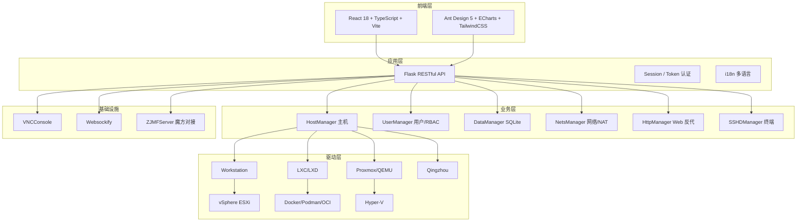

# 项目介绍

## 什么是 OpenIDCS？

**OpenIDCS**（Open Internet Data Center System）是一个完全开源的 **IDC 虚拟化统一管理平台**。它抽象了不同虚拟化产品之间的差异，通过**单一 Web 界面**和**完整的 RESTful API**，让运维团队可以像管理同一种资源一样，同时管理容器、虚拟机、云主机等多种异构算力。

> 一句话：**一个后台，管住所有虚拟化平台**。

## 项目背景

现代数据中心几乎不可能只使用一种虚拟化技术：

- 生产业务跑在 **VMware vSphere / Proxmox VE** 上
- 开发测试常用 **VMware Workstation / Hyper-V**
- 微服务和 CI/CD 依赖 **Docker / Podman**
- 轻量多租户切片使用 **LXC / LXD**
- 部分业务托管在 **青州云** 等自研/私有云

这种"多虚拟化"现状带来了明显痛点：

- 每种平台都有自己的控制台、命令行、API，学习成本高
- 资源、配额、用户、日志各自孤立，无法横向对比
- 计费、告警、审计、备份需要重复开发集成
- 难以对外提供统一的 IDC / 云主机面板

**OpenIDCS 正是为了解决"多虚拟化孤岛"而生。**

## 核心价值

### 🎯 统一管理界面
通过单一 Web 面板管理所有虚拟化平台，不再在多个控制台之间切换。

### 🔌 完整 RESTful API
全部 Web 功能均有对应 API，可无缝集成到魔方财务、自研面板、CI/CD、巡检系统。

### 🌐 跨平台部署
主控端支持 Windows / Linux / macOS，受控端覆盖 x86_64 / ARM64。

### 👥 多租户 + RBAC
内置用户、角色、资源配额、操作审计，天然面向"对外开户"场景。

### 📊 实时监控
主机与虚拟机的 CPU / 内存 / 磁盘 / 网络流量实时可视化。

### 🔒 安全可靠
TLS 双向证书、Token + Session 双重认证、细粒度权限、完整操作日志。

### 🆓 完全开源
采用 **AGPLv3** 协议，允许商业使用与二次开发，代码公开透明。

## 支持的虚拟化平台

OpenIDCS 目前已对接 **7 种主流虚拟化平台**，覆盖从本地开发机到企业级数据中心的全部场景。

| 平台 | 类型 | 状态 | 典型场景 |
|------|------|------|----------|
| **Docker / Podman / K8SC** | 容器 | ✅ 生产就绪 | 微服务、CI 环境、轻量 Web 托管 |
| **LXC / LXD** | 系统容器 | ✅ 生产就绪 | 多租户 VPS、沙箱环境 |
| **VMware Workstation** | 桌面虚拟化 | ✅ 生产就绪 | 开发测试、教学实验 |
| **VMware vSphere ESXi** | 企业级虚拟化 | ✅ 生产就绪 | 核心业务、高可用集群 |
| **Proxmox VE / QEMU** | 开源虚拟化 | ✅ 生产就绪 | 私有云、中小型 IDC |
| **Windows Hyper-V** | 桌面 / Server 虚拟化 | ✅ 生产就绪 | Windows 生态、AD 域环境 |
| **青州云 Qingzhou** | 私有云 | ✅ 生产就绪 | 已有青州云用户的统一纳管 |
| Oracle VirtualBox / QEMU-KVM / MEmu | 多种 | 🚧 开发中 | 规划中 |

> 完整能力矩阵（改密、快照、备份、磁盘挂载、PCI/USB 直通 等）请见 [平台对比总览](/vm/comparison)。

## 技术架构

OpenIDCS 采用典型的**前后端分离 + 插件化驱动**的架构：

### 技术栈摘要

| 层级 | 技术组件 |
|------|----------|
| 前端 | React 18 + TypeScript + Vite + Ant Design 5 + ECharts + TailwindCSS + Zustand |
| 后端 | Python 3.8+ + Flask + Loguru + Requests + Paramiko + pywinrm |
| 数据库 | SQLite |
| 虚拟化 SDK | pyvmomi / pylxd / docker / proxmoxer |
| 打包 | Nuitka / cx_Freeze |

完整架构说明请查阅 [架构设计](/guide/architecture)。

## 适用场景

| 场景 | 说明 |
|------|------|
| 🏢 中小企业 IT | 统一管理开发、测试、生产环境虚拟机 |
| ☁️ 私有云 | 作为私有云的轻量级管理前端，替代厚重的商业面板 |
| 🎓 教育培训 | 实验室 / 培训中心按用户配额共享虚拟机资源 |
| 🔬 研发团队 | 按项目隔离虚拟机集群，控制资源成本 |
| 🏭 IDC 转型 | 帮助传统 IDC 服务商快速上线"云主机"业务 |
| 💰 魔方财务 | 原生支持魔方财务对接，开箱即用的计费分销 |

## 项目状态

OpenIDCS 处于**活跃开发**中，主线功能已稳定可用于生产：

- ✅ 7 种虚拟化平台全部生产就绪
- ✅ 多租户 / RBAC / 配额体系完整
- ✅ VNC / SSH Web 控制台
- ✅ NAT 端口转发、Web 反向代理
- ✅ 魔方财务（SwapIDC / IDCSmart）对接插件
- 🚧 VirtualBox、纯 QEMU-KVM、MEmu 等正在开发

## 开源协议

OpenIDCS 采用 **GNU Affero General Public License v3.0 (AGPLv3)** 协议：

- ✅ 自由使用、修改、分发
- ✅ 可用于商业用途
- ⚠️ 修改后的代码必须开源
- ⚠️ 以 SaaS 方式提供服务也需提供源码

详情见 [开源协议](/about/license)。

## 致谢

OpenIDCS 的受控端 Web 和魔方对接插件风格与部分代码参考了：

- **魔方财务-LXD 对接服务器**（[xkatld/zjmf-lxd-server](https://github.com/xkatld/zjmf-lxd-server)）

感谢所有为开源社区做出贡献的开发者。

## 下一步

- 💎 查看 [核心优势](/guide/advantages) 了解与商业方案的差异
- 📖 查看 [功能概览](/guide/features) 了解详细能力矩阵
- 🏗️ 查看 [架构设计](/guide/architecture) 理解内部原理
- 🚀 查看 [快速上手](/guide/quick-start) 立即开始部署
