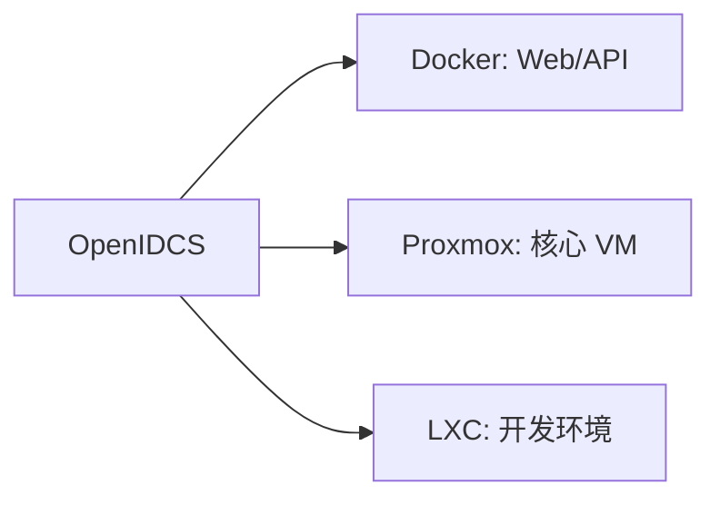

# 虚拟化平台对比总览

OpenIDCS 支持 **7 种主流虚拟化/容器平台**，本页帮助你根据实际场景进行选型。

## 🧭 一句话选型

| 想要的效果 | 推荐平台 |
|---|---|
| 🐳 部署 Web / 微服务 / CI 环境，启动越快越好 | **Docker / Podman** |
| 📦 跑完整 Linux 发行版，但不想开 VM 的性能开销 | **LXC / LXD** |
| 🖥️ 桌面级开发测试，需要跑 Windows / 自定义 ISO | **VMware Workstation** |
| 🏢 企业生产，需要 HA、集群、虚拟磁盘迁移 | **Proxmox VE** / **VMware ESXi** |
| 🪟 纯 Windows Server 环境，不想装第三方组件 | **Windows Hyper-V** |
| ☁️ 已有青州云 / 青云公有云资源接入 | **青州云 (Qingzhou)** |

## 📋 平台能力矩阵

### 基础能力

| 平台 | 虚拟化类型 | 运行开销 | 启动速度 | 支持 OS |
|------|----------|---------|---------|---------|
| **Docker / Podman** | 应用容器 | 极低 | 秒级 | Linux（容器内） |
| **LXC / LXD** | 系统容器 | 极低 | 秒级 | Linux |
| **VMware Workstation** | 类型 2 Hypervisor | 中 | 10-30s | 全平台 |
| **VMware ESXi** | 类型 1 Hypervisor | 低 | 10-30s | 全平台 |
| **Proxmox VE** | KVM + LXC | 低 | 5-20s | 全平台 |
| **Windows Hyper-V** | 类型 1 Hypervisor | 低 | 10-30s | 全平台 |
| **青州云** | 公有云 API | - | - | 全平台 |

### 功能支持矩阵

下表基于 OpenIDCS `HostServer` 模块实际适配情况：

| 功能 | Docker/OCI | LXC/LXD | VMware WS | Proxmox | Hyper-V | ESXi | 青州云 |
|------|:--:|:--:|:--:|:--:|:--:|:--:|:--:|
| 虚拟机生命周期 | ✅ | ✅ | ✅ | ✅ | ✅ | ✅ | ✅ |
| 改密码 `VMPasswd` | ✅* | ✅* | ✅ | ✅ | ✅ | ✅ | ✅ |
| 截图 `VMScreen` | ❌ | ❌ | ✅ | ✅ | ✅ | ✅ | ✅ |
| 备份/还原 | ✅ | ✅ | ✅ | ✅ | ✅ | ✅ | ✅ |
| 列出/删除备份 | ✅ | ✅ | ✅ | ⚠️ | ✅ | ✅ | ✅ |
| 磁盘挂载/卸载 | ✅ | ✅ | ✅ | ✅ | ✅ | ✅ | ✅ |
| ISO 挂载 | ✅ | ❌ | ✅ | ✅ | ✅ | ✅ | ✅ |
| 磁盘检查 | ❌ | ❌ | ✅ | ✅ | ❌ | ✅ | ❌ |
| 磁盘迁移 | ❌ | ❌ | ✅ | ✅ | ❌ | ❌ | ❌ |
| PCI 直通 | ✅ | ❌ | ✅ | ✅ | ✅ | ✅ | ❌ |
| USB 直通 | ❌ | ❌ | ✅ | ✅ | ❌ | ✅ | ❌ |
| VNC 控制台 | ❌ | ❌ | ✅ | ✅ | ✅ | ✅ | ✅ |
| Web 终端 (ttyd) | ✅ | ✅ | ❌ | ❌ | ❌ | ❌ | ❌ |

> 说明：`*` 表示通过 agent/外部方式修改；`⚠️` 表示部分支持。

### 资源隔离强度

```
Docker/Podman  ───────────●─────────────────→ 轻度（共享内核）
LXC/LXD        ────────────●────────────────→ 中度（共享内核 + cgroup）
Hyper-V/ESXi   ────────────────────●────────→ 高度（硬件虚拟化）
VMware WS/PVE  ────────────────────●────────→ 高度（硬件虚拟化）
青州云         ────────────────────────●────→ 多租户隔离
```

## 🎯 典型场景推荐

### 场景 1：中小企业 IT，混合环境

推荐组合：**Docker（容器服务）+ Proxmox（核心 VM）**



### 场景 2：IDC 转型做虚拟化售卖

推荐组合：**Proxmox + LXD**

- Proxmox 做 KVM 虚机（卖给要完整 Linux/Windows 的用户）
- LXD 做容器套餐（便宜、密度高）
- OpenIDCS 对接魔方财务，自动开通/暂停/续费

### 场景 3：研发 / 教学

推荐：**VMware Workstation（本地）** 或 **LXC/LXD（轻量）**

- Workstation：学生可以随时快照回滚、跑 Windows 实验
- LXC：同样配置能跑出 3-5 倍密度

### 场景 4：纯 Windows Server 环境

推荐：**Hyper-V**

- 无需安装第三方 Hypervisor
- 与 AD、WinRM、PowerShell 深度集成
- OpenIDCS 通过 PS 脚本直连管理

## 🏗️ 架构差异说明

### 受控端资源占用对比（空载）

| 平台 | 内存 | CPU | 磁盘 |
|------|-----|-----|------|
| Docker Engine | ~100 MB | <1% | ~500 MB |
| LXD | ~150 MB | <1% | ~300 MB |
| VMware Workstation | ~400 MB | 1-3% | ~2 GB |
| Proxmox VE | ~800 MB | 1-3% | ~4 GB |
| Hyper-V | ~500 MB | 1-2% | ~3 GB |
| ESXi | ~1.5 GB | 2-5% | 独占整机 |

### 管理协议对比

| 平台 | 协议 | 端口 | 认证 |
|------|------|------|------|
| Docker / Podman | HTTPS (REST) | 2376 | TLS 双向证书 |
| LXC / LXD | HTTPS (REST) | 8443 | TLS 双向证书 |
| VMware Workstation | HTTPS (REST) | 8697 | Basic Auth |
| Proxmox VE | HTTPS (REST) | 8006 | Token / PAM |
| Hyper-V | WinRM (PS) | 5985/5986 | NTLM / Kerberos |
| ESXi | HTTPS (SOAP) | 443 | vSphere 账户 |
| 青州云 | HTTPS (REST) | 443 | AccessKey |

## 📖 详细配置文档

- 🐳 [Docker / Podman 配置](/vm/docker)
- 📦 [LXC / LXD 配置](/vm/lxd)
- 🖥️ [VMware Workstation 配置](/vm/vmware)
- 🏢 [Proxmox VE 配置](/vm/proxmox)
- 🌐 [VMware vSphere ESXi 配置](/vm/esxi)
- 🪟 [Windows Hyper-V 配置](/vm/hyperv)
- ☁️ [青州云配置](/vm/qingzhou)

## 下一步

- 📖 先看 [项目介绍](/guide/introduction) 了解 OpenIDCS 定位
- 🚀 选好平台后，跳转到对应文档开始 [快速上手](/guide/quick-start)
